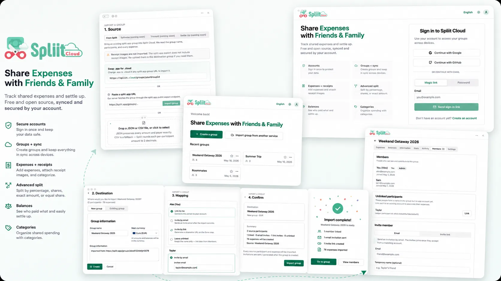

**Spliit Cloud is a community-maintained fork of Spliit: a free, open-source expense splitting app for groups, trips, roommates, friends, and shared costs.**

It keeps the simplicity of the original Spliit while moving toward cloud accounts, reliable group syncing, stronger tests, and a more maintainable stack.


> [!NOTE]
> Spliit Cloud is stable enough for testing and everyday usage, but it is still evolving quickly. Please report bugs, missing features, and migration issues.

## Try it

Public instance: **[https://spliit.cloud](https://spliit.cloud)**

You can also self-host your own instance. See [Self-hosting overview](#self-hosting-overview), [Run locally](#run-locally), and [Run in a container](#run-in-a-container).

> [!IMPORTANT]
> The public instance is provided as a community-hosted service. If you need full control over data, uptime, backups, or privacy, self-hosting is recommended.



## What is Spliit Cloud?

Spliit Cloud is a community-maintained fork of [Spliit](https://github.com/spliit-app/spliit), the open-source expense splitter originally created by [Sebastien Castiel](https://github.com/scastiel). It aims to keep the lightweight, no-frills experience that made Spliit popular while evolving the product toward real cloud accounts, reliable multi-device sync, and a stack that is easier to operate and self-host.

The public instance lives at [spliit.cloud](https://spliit.cloud): the web app runs on Cloudflare Pages, the API runs on a Hetzner VPS via Dokploy with PostgreSQL on the same VPS, database backups are written to a dedicated Cloudflare R2 bucket, and asset uploads are stored in a separate Cloudflare R2 bucket.

## Why this fork exists

Spliit Cloud exists because I liked Spliit and wanted to keep using it with my friends.

The original Spliit project, created by [Sebastien Castiel](https://github.com/scastiel), is a clean and useful open-source alternative to Splitwise. I first looked at contributing improvements upstream, but after submitting fixes and reviewing existing issues and pull requests, the project appeared to have slowed down.

This fork is meant to continue that work openly, with proper credit to the original author and project.

The main things I wanted to improve are:

- authenticated accounts
- reliable group syncing across devices and users
- account-only groups (no more anonymous local-only groups)
- a stronger test suite
- a lighter and easier-to-operate stack
- clearer self-hosting and deployment paths
- migration/import support for existing Spliit groups

Spliit Cloud intentionally ships only account-bound groups. I explored supporting both local and synced groups in [spliit-app/spliit#495](https://github.com/spliit-app/spliit/pull/495), but the dual model became hard to implement and hard to explain. Account-only groups keep the mental model simple, the data secure, and the path clear for future features. See the [FAQ](#why-are-there-no-local-only--anonymous-groups) for the full reasoning.

Spliit Cloud is not affiliated with the original Spliit project unless stated otherwise.

## Relationship to Spliit

Spliit Cloud is a community fork of [spliit-app/spliit](https://github.com/spliit-app/spliit).

Credit for the original idea, design, and foundation belongs to the original Spliit project and its creator, [Sebastien Castiel](https://github.com/scastiel).

This fork keeps the project open-source and aims to continue development in a direction focused on accounts, syncing, maintainability, and self-hosting.

The original `spliit-app/spliit` project appears to have slowed down, with many issues and pull requests not receiving maintainer responses recently. This fork exists to keep the project moving in a more focused direction while preserving credit to the original work.

## Who is this for?

Spliit Cloud may be useful if you want:

- a free and open-source alternative to Splitwise
- shared expense tracking for trips, friends, roommates, couples, or small groups
- a hosted app with accounts and synced groups
- a self-hostable expense splitting app
- a project that is actively maintained and open to contributions
- a codebase with stronger tests and a simpler operating model

## Features

- [x] Create a group and share it with friends
- [x] Create expenses with description
- [x] Display group balances
- [x] Create reimbursement expenses
- [x] Progressive Web App
- [x] Select all/no participant for expenses
- [x] Split expenses unevenly
- [x] Mark a group as favorite
- [x] Tell the application who you are when opening a group
- [x] Assign a category to expenses
- [x] Search for expenses in a group
- [x] Upload and attach images to expenses
- [x] Create expense by scanning a receipt
- [x] Cloud accounts and group synchronization
- [x] Multi-payer expenses — split the cost paid by several members with per-payer shares

## Roadmap

The [detailed roadmap](./ROADMAP.md) is the source of truth. Current work focuses on expense workflow improvements (multi-payer, itemized, recurring expenses, account overview), account customization (profile photos, app theme, favourite currencies, per-user BYOK), and privacy/trust features (end-to-end encryption, public API, offline support).

## Known limitations

Spliit Cloud is still evolving. Current limitations may include:

- account and sync flows are still being refined
- offline-first usage is not complete yet
- notification settings are not implemented yet
- Weblate translation workflow is not set up for this fork yet
- end-to-end encryption is planned but not available yet

Please open an issue if you hit a bug or if a missing feature blocks your usage.

## Data and privacy

Spliit Cloud stores expense data needed to make the app work, including groups, participants, expenses, balances, and uploaded expense documents if that feature is enabled.

The public instance is hosted as follows:

- web app: Cloudflare Pages
- API: Hetzner VPS via Dokploy
- database: PostgreSQL
- database backups: Cloudflare R2
- uploaded assets: Cloudflare R2

For users who want full control over data and infrastructure, self-hosting is supported. See [PRIVACY.md](./PRIVACY.md) for the detailed data-handling notes and [Self-hosting overview](#self-hosting-overview) for running your own instance.

## Security

If you discover a security issue, please follow the responsible disclosure process in [SECURITY.md](./SECURITY.md) instead of opening a public issue.

## Self-hosting overview

The current project focus is on the cloud account system and the public instance at [spliit.cloud](https://spliit.cloud). Self-hosting is supported but is not the primary development priority at this stage.

Spliit Cloud can be self-hosted with a web frontend, an API service, PostgreSQL, optional S3-compatible storage for expense documents, and optional OpenAI-compatible configuration for receipt scanning and category extraction.

The simplest local setup uses the included scripts and a local PostgreSQL container.

## Run locally

1. Clone the repository (or fork it if you intend to contribute)
2. Run `bun install` to install dependencies.
3. Start a PostgreSQL server with `./scripts/start-local-db.sh`.
4. Copy the file `.env.example` as `.env`
5. Run prisma migrations and generate the client with `bun prisma-migrate` and `bun prisma-generate`
6. Run `bun dev` to start the web app at http://localhost:3000 and API at http://localhost:3001

## Run in a container

1. Copy the file `container.env.example` as `container.env`.
2. Set `POSTGRES_PASSWORD` to a long random value.
3. Set `WEB_ORIGINS` to the public web origin.
4. Run `bun start-container` to start the API and Postgres.

The API is available at http://localhost:3001. The database is only reachable on the internal Docker network and stores data in the `postgres_data` Docker volume.

For Dokploy on a single Hetzner VPS, publish only the `api` service as your API domain and keep the `db` service private. If the web app is hosted on Cloudflare Pages, set `VITE_API_URL` there to the public Dokploy API origin, for example `https://api.spliit.example.com`. Configure off-server Postgres backups separately.

See [docs/deployment.md](./docs/deployment.md) for preliminary production notes.

## Production deployment

> Production self-hosting guidance is preliminary. The project is focused on the cloud account system; detailed deployment documentation will be expanded as self-hosting matures.

Key requirements for a public instance:

- `BETTER_AUTH_SECRET` (generate with `openssl rand -base64 32`)
- HTTPS on both web and API origins
- persistent PostgreSQL storage with off-server backups
- SMTP configured (`SMTP_HOST`, `EMAIL_FROM`) for sign-in and invitations
- `db` service on a private network (only `api` reachable publicly)
- tested database restore procedure

## Health check

The application has a health check endpoint that can be used to check if the application is running and if the database is accessible.

- `GET /health/readiness` or `GET /health` - Check if the API is ready to serve requests, including database connectivity.
- `GET /health/liveness` - Check if the API process is running, but not necessarily ready to serve requests.

## Opt-in features

### Expense documents

Spliit Cloud offers users to upload images (to an AWS S3 bucket) and attach them to expenses. To enable this feature:

- Create and configure an S3-compatible bucket where images will be stored.
- Update your environments variables with appropriate values:

```.env
PUBLIC_ENABLE_EXPENSE_DOCUMENTS=true
S3_UPLOAD_KEY=AAAAAAAAAAAAAAAAAAAA
S3_UPLOAD_SECRET=AAAAAAAAAAAAAAAAAAAAAAAAAAAAAAAAAAAAAAAA
S3_UPLOAD_BUCKET=name-of-s3-bucket
S3_UPLOAD_REGION=us-east-1
S3_UPLOAD_PUBLIC_URL=https://uploads.example.com
```

You can also use other S3 providers by providing a custom endpoint:

```.env
S3_UPLOAD_ENDPOINT=http://localhost:9000
```

`S3_UPLOAD_ENDPOINT` is used for signing uploads. `S3_UPLOAD_PUBLIC_URL` is an
optional browser-readable base URL stored on expense documents and must serve
objects by key, for example `https://uploads.example.com/document-...jpg`. If it
is not configured, documents use the default AWS S3 public URL format.

### Create expense from receipt

You can offer users to create expense by uploading a receipt. This feature relies on an OpenAI-compatible API and a public S3 storage endpoint.

To enable the feature:

- You must enable expense documents feature as well (see section above). That might change in the future, but for now we need to store images to make receipt scanning work.
- Subscribe to an OpenAI-compatible provider and get an API key.
- Update your environment variables with appropriate values:

```.env
PUBLIC_ENABLE_RECEIPT_EXTRACT=true
OPENAI_API_KEY=XXXXXXXXXXXXXXXXXXXXXXXXXXXX
```

The model used for receipt extraction defaults to `gpt-5-nano`. Override it with `OPENAI_RECEIPT_MODEL`.

### Deduce category from title

You can offer users to automatically deduce the expense category from the title. This feature relies on an OpenAI-compatible API, follow the signup instructions above and configure the following environment variables:

```.env
PUBLIC_ENABLE_CATEGORY_EXTRACT=true
OPENAI_API_KEY=XXXXXXXXXXXXXXXXXXXXXXXXXXXX
```

The model used for category extraction defaults to `gpt-3.5-turbo`. Override it with `OPENAI_CATEGORY_MODEL`.

### Using an OpenAI-compatible provider

Both AI features can use any OpenAI-compatible provider by setting a custom base URL:

```.env
OPENAI_BASE_URL=https://openrouter.ai/api/v1
OPENAI_RECEIPT_MODEL=openai/gpt-4o-mini
OPENAI_CATEGORY_MODEL=openai/gpt-4o-mini
```

`OPENAI_BASE_URL` is optional. When unset, the official OpenAI endpoint is used.

## Stack

- [Vite](https://vite.dev/) + [React](https://react.dev/) for the web SPA, replacing Next.js in favor of simplicity, efficiency, and room for future expansion
- [Hono](https://hono.dev/) + [tRPC](https://trpc.io/) for the API, also chosen over Next.js API routes for a smaller and more explicit runtime
- [Bun](https://bun.sh/) for package management and the API runtime
- [TailwindCSS](https://tailwindcss.com/) for the styling
- [shadcn/UI](https://ui.shadcn.com/) for the UI components
- [Prisma](https://prisma.io) to access the database

## Import and export

Import support is done for `spliit.app` groups. Import goals:

- import existing group data where possible
- preserve expenses, participants, balances, and categories
- make migration from original Spliit instances as painless as possible

Export support is also planned so users can keep ownership of their data.

See [docs/migration.md](./docs/migration.md) for the step-by-step migration guide from original Spliit.

## Contributing

The project is open to contributions. Feel free to open an issue or even a pull request!

See [CONTRIBUTING.md](./CONTRIBUTING.md) for the workflow, local setup, and PR expectations.

Financial support links are TBD. See [Support the project](#support-the-project) for non-financial ways to help.

### Development principles

- Keep the stack small and explicit. Vite + React on the web, Hono + tRPC on the API, PostgreSQL via Prisma.
- Validate at the boundary with Zod, keep tRPC procedures thin, and put real business logic in shared domain or API helpers.
- Treat the schema, migrations, and generated Prisma client as a single unit — commit them together.
- Comments explain _why_, not _what_. When in doubt, drop the comment.
- Money is stored as integer cents; percentage shares use basis points.

### Correctness

- Unit tests live next to the code they cover and run with `bun run test`.
- Critical flows (balances, splits, recurrence, currency conversion) are expected to have tests before they ship.
- Type safety is enforced with `bun check-types`; CI should not be the first place a type error surfaces.

## FAQ

### Is Spliit Cloud affiliated with the original Spliit project?

No. Spliit Cloud is an independent community fork of Spliit. The original Spliit project was created by Sebastien Castiel.

### Why not just contribute to the original project?

That was the original intention. After submitting fixes and reviewing existing issues and pull requests, the original project appeared to have slowed down. This fork allows development to continue while keeping the work open-source and properly attributed.

### Is Spliit Cloud free?

The code is open-source under the MIT license. The public hosted instance is currently provided as a community service. Long-term hosting/support details may evolve.

### Can I self-host it?

Yes. Self-hosting is supported. See the local and container setup instructions below.

### Can I migrate from original Spliit?

Yes. Import of `spliit.app` group exports is supported today; see [docs/migration.md](./docs/migration.md) for the step-by-step. Self-hosted Spliit instances can be migrated by exporting each group and importing it into Spliit Cloud.

### Why are there no local-only / anonymous groups?

In the original Spliit, groups lived entirely in your browser and were identified by a URL or group ID. In practice that led to:

- **Confusion**: friends and family who tried the app weren't sure how local groups worked, who could edit what, or where the data lived.
- **Data loss**: clearing site data, switching browsers, or reinstalling silently remove the group from their "account".
- **Lost access**: lose the link and the group is gone.
- **Weak security**: anyone who stumbled on a group ID had full edit access, and even trusted participants could make a mistaken or bad-faith edit with no real recourse.

I tried supporting both local and synced groups in [spliit-app/spliit#495](https://github.com/spliit-app/spliit/pull/495), but the dual model became too complex to build and too complex to explain. Account-only groups give Spliit Cloud a simpler mental model, real ownership, easier collaboration, and a foundation for features like member management and notifications. Local-only groups are probably not coming back.

### Is my data end-to-end encrypted?

Not yet. End-to-end encrypted groups and expenses are on the roadmap.

### Can I contribute?

Yes. Issues, bug reports, tests, documentation, translations, and pull requests are welcome.

## Support the project

For now, the best ways to support Spliit Cloud are:

- star the repository
- try the app and report bugs
- improve documentation
- contribute tests
- help with translations
- share feedback from real usage

## Links

- App: [spliit.cloud](https://spliit.cloud)
- Repository: [github.com/antonio-ivanovski/spliit-cloud](https://github.com/antonio-ivanovski/spliit-cloud)
- Original Spliit repository: [github.com/spliit-app/spliit](https://github.com/spliit-app/spliit)
- Original creator: [Sebastien Castiel](https://github.com/scastiel)

## License

MIT, see [LICENSE](./LICENSE).
