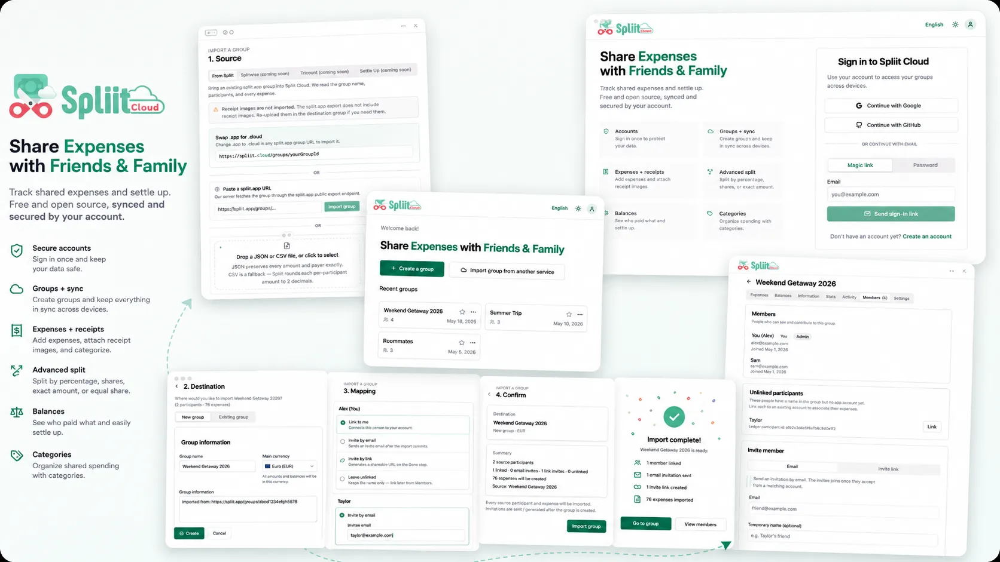

**Spliit Cloud is a community-maintained fork of Spliit: a free, open-source expense splitting app for groups, trips, roommates, friends, and shared costs.**

**No email or social login required:** start with an anonymous account in a few clicks — no email address, no Google/GitHub/OIDC — and keep it recoverable with a recovery link or a passkey.

It keeps the simplicity of the original Spliit while fixing its biggest weakness: groups that lived only in the browser and never synced properly across devices. Cloud accounts give you reliable group syncing, stronger tests, and a more maintainable stack — without forcing everyone onto email.


[](https://status.spliit.cloud/)


## Try it

Public instance: **[https://spliit.cloud](https://spliit.cloud)** — no email or social account needed. Choose the anonymous option at sign-up (a display name plus a recovery link or passkey) and you get synced groups on all your devices.

Live uptime & incident status at **[https://status.spliit.cloud](https://status.spliit.cloud/)**

You can also self-host your own instance. See [Self-hosting overview](#self-hosting-overview), [Run locally](#run-locally), and [Run in a container](#run-in-a-container).

> [!IMPORTANT]
> The public instance is provided as a community-hosted service. If you need full control over data, uptime, backups, or privacy, self-hosting is recommended.



## What is Spliit Cloud?

Spliit Cloud is a community-maintained fork of [Spliit](https://github.com/spliit-app/spliit), the open-source expense splitter originally created by [Sebastien Castiel](https://github.com/scastiel). It aims to keep the lightweight, no-frills experience that made Spliit popular while evolving the product toward reliable multi-device sync and a stack that is easier to operate and self-host.

People loved that original Spliit needed no account — and hated that their groups lived only in one browser, vanished when site data was cleared, and never synced to their phone. Spliit Cloud is the middle ground: an **anonymous account takes a few clicks and asks for no email or social identity**, yet your groups follow you across devices and every edit is attributable to a real member. Add email, social login, or a passkey later if you want — or never.

The public instance lives at [spliit.cloud](https://spliit.cloud): the web app runs on Cloudflare Pages, the API runs on a Hetzner VPS via Dokploy with PostgreSQL on the same VPS, database backups are written to a dedicated Cloudflare R2 bucket, and asset uploads are stored in a separate Cloudflare R2 bucket.

## Why this fork exists

Spliit Cloud exists because I liked Spliit and wanted to keep using it with my friends.

The original Spliit project, created by [Sebastien Castiel](https://github.com/scastiel), is a clean and useful open-source alternative to Splitwise. I first looked at contributing improvements upstream, but after submitting fixes and reviewing existing issues and pull requests at the time, the project appeared to have slowed down.

Since then upstream has become active again (see [Relationship to Spliit](#relationship-to-spliit)): `1.20–1.26` shipped global balances, expanded stats, PWA offline assets, monthly category visuals, and security hardening. The stacks and data models have diverged too far to merge back, and hundreds of people now depend on `spliit.cloud` — so this fork continues as its own line while porting upstream prior art where it fits.

This fork is meant to continue that work openly, with proper credit to the original author and project.

The main things I wanted to improve are:

- authenticated accounts, including an email-free and social-free anonymous option
- reliable group syncing across devices and users
- account-bound groups (no more local-only groups identified only by a URL)
- a stronger test suite
- a lighter and easier-to-operate stack
- clearer self-hosting and deployment paths
- migration/import support for existing Spliit groups

Spliit Cloud ships only account-bound groups. I explored supporting both local and synced groups in [spliit-app/spliit#495](https://github.com/spliit-app/spliit/pull/495), but the dual model became hard to implement and hard to explain. Binding groups to accounts keeps the mental model simple, the data secure, and every action attributable to a member. You do not have to use email or social login: create an **anonymous account in a few clicks** — just a display name, no email address, no Google/GitHub/OIDC — and keep it with a recovery link or a passkey. You get all the benefits of synced groups with the same simplicity people loved about account-free Spliit, while the group still sees a real member with authorization instead of a shared URL anyone can edit. See the [FAQ](#do-i-need-email-or-social-login) for the full reasoning.

Spliit Cloud is not affiliated with the original Spliit project unless stated otherwise.

## Relationship to Spliit

Spliit Cloud is a community fork of [spliit-app/spliit](https://github.com/spliit-app/spliit).

Credit for the original idea, design, and foundation belongs to the original Spliit project and its creator, [Sebastien Castiel](https://github.com/scastiel).

This fork keeps the project open-source and aims to continue development in a direction focused on accounts, syncing, maintainability, and self-hosting.

Upstream is actively maintained again: since August 2026 it has shipped `1.20–1.26` with real improvements (global balances, expanded group stats with date ranges and drill-downs, monthly category visuals, PWA service worker with offline assets, settle-up in a non-group currency, configurable OpenAI endpoint/models, security headers/CSP, and even-split previews). Switching back is no longer practical — hundreds of people depend on `spliit.cloud`, groups here are account-bound rather than URL-identified (with anonymous accounts preserving the no-email simplicity), and the stacks have diverged (Vite + React SPA with Hono + tRPC here, Next.js upstream). Where upstream ships useful prior art, this fork ports and credits it instead of pretending the gap is still one-sided; the feature table below reflects that parity honestly.

## Who is this for?

Spliit Cloud may be useful if you want:

- a free and open-source alternative to Splitwise
- shared expense tracking for trips, friends, roommates, couples, or small groups
- a hosted app with synced groups and accounts — with an anonymous option that needs no email or social login and recovers via link or passkey
- a self-hostable expense splitting app
- a project that is actively maintained and open to contributions
- a codebase with stronger tests and a simpler operating model

## Features

| Feature                               | Why it matters                                                                                                                                                                                                                                                                                        | Spliit Cloud | Original Spliit                                                        |
| ------------------------------------- | ----------------------------------------------------------------------------------------------------------------------------------------------------------------------------------------------------------------------------------------------------------------------------------------------------- | ------------ | ---------------------------------------------------------------------- |
| Core Spliit features                  | Groups, categories, receipts and drag-and-drop attachments, balances, settlements, advanced splits, PWA support, and no ads. Upstream added an offline-asset service worker with update prompt in `1.23.0`.                                                                                           | ✅           | ✅                                                                     |
| Accounts, friends, and synced groups  | Sign in with email, passkeys, optional OIDC/OAuth, or an anonymous account with no email or social login. Profile avatars, 1-on-1 friend ledgers, password set/change, email change, last-used sign-in badge, and groups that follow you across devices—with every action attributable to an account. | ✅           | ❌                                                                     |
| Passkeys and account security         | Passwordless sign-in for every account type (including guests), backup sign-in choice at signup, per-instance `ENABLE_PASSKEY_AUTH` kill switch, invite-only `SIGNUP_MODE` for private instances.                                                                                                     | ✅           | ❌                                                                     |
| Import and export                     | Import Splitwise CSV, bank-statement CSVs (mapping wizard, duplicate detection), Cospend projects, original Spliit, and Spliit Cloud bundles; export CSV, printable PDF reports, and full group or account ZIP archives including documents. Upstream added notes/history to JSON export in `1.21.0`. | ✅           | ❓ (group JSON export only; Splitwise #483 / Tricount #526 still open) |
| Reliable currency handling            | Multi-currency expenses with server-side conversion, a conversion widget, exact group-currency amount override (fees included, implied rate shown), and cryptocurrency support. Upstream fixed the Frankfurter endpoint and minor-units bugs and added settle-in-other-currency in `1.20–1.23`.       | ✅           | ❓ (fixed basics, no server conversion widget or crypto)               |
| Multiple payers and itemized expenses | Track several payers, line items, tax, tip, proportional-to-items remainder splits, and precise per-person shares in one expense.                                                                                                                                                                     | ✅           | ❌                                                                     |
| Durable recurring expenses            | Create real recurrence series with intervals, date/count/indefinite endings, catch-up, retries, history, previews, navigation, and explicit stop/edit/delete controls—not read-time side effects. Upstream recurrence got E2E and date fixes but no durable series.                                   | ✅           | ❓ (basic recurrence only)                                             |
| Activity, comments, and discovery     | Per-expense change history and comments, For-you/All involving timeline, manual date entry, archived-group search, plus preview, filtering, sorting, and search across groups—without opening the edit form.                                                                                          | ✅           | ❓                                                                     |
| Sharing and group identity            | Multi-use 15-minute Nearby QR invites with Scan-to-join, group emoji and colors, public view-only links, and member management. Upstream rebased QR sharing in `1.22.0`.                                                                                                                              | ✅           | ❓ (QR sharing only)                                                   |
| Outbound webhooks                     | Subscribe any HTTPS endpoint to signed `expense.created/updated/deleted` events with retries, delivery history, redelivery, involved-only filtering, and per-endpoint secrets.                                                                                                                        | ✅           | ❌                                                                     |
| Email and push notifications          | Deliver group and expense updates through email or push, with per-user preferences for which categories and channels are enabled. SSO-only instances (`ENABLE_EMAIL_AUTH=false`) run without SMTP.                                                                                                    | ✅           | ❌                                                                     |
| Stats, charts, and budgets            | Per-group spending charts, monthly category visuals, cross-group roll-up, plus weekly, monthly, yearly, or custom budgets by category and participant, with over-budget notifications. Upstream added global balance, expanded stats, drill-downs, and monthly visuals v1 in `1.23–1.25`.             | ✅           | ❓ (stats without budgets)                                             |
| Balances, settlements, and subgroups  | Switch between balance views, settle faster, combine compatible payments, or settle as subgroup units such as couples. Upstream added by-amount remainder display and even-split previews in `1.25–1.26`.                                                                                             | ✅           | ❓ (basic balances only)                                               |
| Full localization                     | Supported languages have complete and a maintained i18n validation workflow, with sparse overlays and fallback chains (e.g. en-GB, pt-BR). Upstream uses Weblate with steady translation activity.                                                                                                    | ✅           | ❓ (Weblate, no audited-complete workflow)                             |
| OpenAPI, Scalar, MCP, and OAuth       | Explore the published API interactively, consume the OpenAPI spec, create expenses from ChatGPT and Claude through the optional MCP assistant, or connect scripts and agents via delegated OAuth 2.1 with per-resource scopes and connected-app controls.                                             | ✅           | ❌                                                                     |
| Versioned releases and images         | Every release publishes immutable `:vX.Y.Z` GHCR images for all services with `:latest` tracking the newest stable release; `SPLIIT_TAG` pins upgrades and the public instance deploys per release. Upstream ships standalone/runtime images with feature flags.                                      | ✅           | ❓ (images, no versioned release train)                                |
| Group archive & delete                | Archive groups to make them view-only, or permanently delete them when no longer needed.                                                                                                                                                                                                              | ✅           | ❌                                                                     |
| AI-assisted expense workflows         | Categorize from the title via local dictionary, group history, then one AI engine (LLM or System One Jev with `AI_CATEGORY_ENGINE`), uncertain guesses as one-tap chips, per-user opt-out; scan receipts and describe expenses by voice; extracted details stay up for review before saving.          | ✅           | ❓ (configurable OpenAI endpoint/models since `1.23.0`)                |
| Expense amount calculator             | A calculator widget in the expense amount field for quick arithmetic while entering expenses.                                                                                                                                                                                                         | ✅           | ❌                                                                     |
| Responsive mobile experience          | Mobile-specific layouts and interaction patterns improve the experience beyond simply narrowing the desktop UI. Upstream added mobile tab icons in `1.23.0`.                                                                                                                                          | ✅           | ❓ (mostly a narrow desktop app)                                       |
| Active maintenance                    | New features, fixes, and self-hosting improvements continue to move forward — see [releases][latest-releases]. Upstream is active again too (`1.20–1.26` in Aug–Sep 2026 with stats, PWA, security, and perf work).                                                                                   | ✅           | ✅                                                                     |

[latest-releases]: https://github.com/antonio-ivanovski/spliit-cloud/releases

## Roadmap

The [detailed roadmap](./ROADMAP.md) is the source of truth. Recent work shipped imports (bank CSV, Cospend), delegated OAuth for agents, Nearby QR invites, outbound webhooks, group emoji/colors, passkeys, and System One categorization. Next up are privacy/trust features (end-to-end encryption and offline support), expanded integrations, and self-hosting polish.

## Known limitations

Spliit Cloud is still evolving. Current limitations may include:

- offline-first usage is not complete yet
- end-to-end encryption is planned but not available yet

Please open an issue if you hit a bug or if a missing feature blocks your usage.

## Data and privacy

Spliit Cloud stores expense data needed to make the app work, including groups, participants, expenses, balances, and uploaded expense documents if that feature is enabled.

The public instance is hosted as follows:

- web app: Cloudflare Pages
- API: Hetzner VPS via Dokploy
- database: PostgreSQL
- database backups: Cloudflare R2
- uploaded assets: Cloudflare R2

For users who want full control over data and infrastructure, self-hosting is supported. See [PRIVACY.md](./PRIVACY.md) for the detailed data-handling notes and [Self-hosting overview](#self-hosting-overview) for running your own instance.

## Security

If you discover a security issue, please follow the responsible disclosure process in [SECURITY.md](./SECURITY.md) instead of opening a public issue.

## Self-hosting overview

The supported Docker setup runs the web app, API, background worker, migrations,
and PostgreSQL as one Compose project. The web container is the only public
entry point: it serves the SPA and proxies API/auth requests over the private
Docker network. Point any HTTPS reverse proxy at the web port.

By default, SMTP is required for sign-in links, email verification, recovery,
and invitations. Set `ENABLE_EMAIL_AUTH=false` for an SSO-only instance: the email
form is hidden, email endpoints are rejected, and SMTP becomes optional — see
[docs/deployment.md](./docs/deployment.md). S3-compatible document storage, AI
features, OAuth providers, Web Push, and the MCP assistant are optional.

## Run locally

1. Clone the repository (or your fork if you intend to contribute).
2. Run `bun install` to install dependencies.
3. Copy `.env.example` to `.env` (`cp .env.example .env`).
4. Start local services, run Prisma operations, and start the app servers:

   ```bash
   bun dev:up                       # postgres, maxio, maildev via compose.dev.yaml
   bun prisma-migrate
    bun dev                          # web on :3000, api on :3001, worker admin on :3003
   ```

   Opt-in only (not started by `bun dev` — run manually when needed):

   ```bash
   bun --filter @spliit/mcp dev:mcp                # MCP on :3002
   bun --filter @spliit/webhook-relay dev:relay    # Cloudflare relay on :8787
   ```

   `bun dev:down` stops the local service containers. Remove `storage/` for a
   clean reset of all local service state.

Local services exposed by `bun dev:up`:

- PostgreSQL on `localhost:5432`
- MaxIO object storage at http://localhost:9000/ui/
- MailDev email inbox at http://localhost:1080

State for the local services lives under `storage/` at the repo root. The
MaxIO bucket CORS/public-read config lives at
`storage/maxio/buckets/spliit-local/.bucket.json`; other local service state is
ignored by Git.

## Run in a container

1. Download `compose.yaml` and `container.env.example`, or clone this
   repository.
2. Copy `container.env.example` to `container.env`.
3. Set `APP_URL`, `POSTGRES_PASSWORD`, `BETTER_AUTH_SECRET`, the SMTP settings,
   `EMAIL_FROM`, and `EMAIL_UNSUBSCRIBE_SECRET` (SMTP settings are optional when
   `ENABLE_EMAIL_AUTH=false`).
4. Start the stack:

   ```bash
   docker compose --env-file container.env up -d
   ```

The web gateway listens on `127.0.0.1:3000` by default. Configure your reverse
proxy to forward the public `APP_URL` to that address. Change `WEB_PORT` when
needed; set `BIND_ADDRESS=0.0.0.0` only when the port must be reachable beyond
the local host.

The API, worker, and database remain private. Migrations run automatically
before the API starts, and PostgreSQL data is stored in the `postgres_data`
volume.

To expose the API directly for debugging or an intentional split-origin
deployment:

```bash
docker compose \
  --env-file container.env \
  -f compose.yaml \
  -f compose.api-port.yaml \
  up -d
```

Developers can build the same stack from source with
`-f compose.yaml -f compose.build.yaml`.

Images are published to GHCR as immutable `:vX.Y.Z` tags for every release,
with `:latest` tracking the newest stable release (never a `main` snapshot).
Pin `SPLIIT_TAG=vX.Y.Z` in `container.env` for controlled upgrades, or follow
stable with `SPLIIT_TAG=latest`.

See [docs/deployment.md](./docs/deployment.md) for configuration, reverse-proxy,
upgrade, backup, and optional-feature guidance. For a private instance, set
`SIGNUP_MODE=invite_only` in `container.env` so only invited people can create
accounts.

## Production deployment

Key requirements for a public instance:

- `BETTER_AUTH_SECRET` generated with `openssl rand -base64 32`
- `EMAIL_UNSUBSCRIBE_SECRET` generated with `openssl rand -hex 32`
- HTTPS on the configured `APP_URL`
- persistent PostgreSQL storage with off-server backups
- working SMTP and correctly configured SPF/DKIM/DMARC (required unless the
  instance is SSO-only with `ENABLE_EMAIL_AUTH=false` and no SMTP configured —
  see [docs/deployment.md](./docs/deployment.md))
- only the web gateway reachable publicly
- tested database restore procedure
- for a private instance, `SIGNUP_MODE=invite_only` so only invited people can create accounts (the first user on a fresh instance can always register)

## Health check

The application has a health check endpoint that can be used to check if the application is running and if the database is accessible.

- `GET /health/readiness` or `GET /health` - Check if the API is ready to serve requests, including database connectivity.
- `GET /health/liveness` - Check if the API process is running, but not necessarily ready to serve requests.

## Opt-in features

### Expense documents

Spliit Cloud offers users to upload images (to an AWS S3 bucket) and attach them to expenses. To enable this feature:

- Create and configure an S3-compatible bucket where images will be stored.
- Update your environments variables with appropriate values:

```.env
PUBLIC_ENABLE_EXPENSE_DOCUMENTS=true
S3_UPLOAD_KEY=AAAAAAAAAAAAAAAAAAAA
S3_UPLOAD_SECRET=AAAAAAAAAAAAAAAAAAAAAAAAAAAAAAAAAAAAAAAA
S3_UPLOAD_BUCKET=name-of-s3-bucket
S3_UPLOAD_REGION=us-east-1
S3_UPLOAD_PUBLIC_URL=https://uploads.example.com
```

You can also use other S3 providers by providing a custom endpoint:

```.env
S3_UPLOAD_ENDPOINT=http://localhost:9000
```

`S3_UPLOAD_ENDPOINT` is used for signing uploads. `S3_UPLOAD_PUBLIC_URL` is an
optional browser-readable base URL stored on expense documents and must serve
objects by key, for example `https://uploads.example.com/document-...jpg`. If it
is not configured, documents use the default AWS S3 public URL format.

Configure an object lifecycle rule for the `tmp/imports/` prefix with a
one-day expiration. The import flow deletes its temporary copies after a
successful database commit, while the lifecycle rule cleans up abandoned or
interrupted imports.

### Create expense from receipt

You can offer users to create expense by uploading a receipt. This feature relies on an AI provider and a public S3 storage endpoint.

To enable the feature:

- You must enable expense documents feature as well (see section above). That might change in the future, but for now we need to store images to make receipt scanning work.
- Subscribe to an AI provider and get an API key.
- Update your environment variables with appropriate values:

```.env
PUBLIC_ENABLE_RECEIPT_EXTRACT=true
AI_API_KEY=XXXXXXXXXXXXXXXXXXXXXXXXXXXX
```

The model used for receipt extraction defaults to `gpt-5-nano`. Override it with `AI_RECEIPT_MODEL`.

Receipt scans time out after `AI_RECEIPT_TIMEOUT_SECONDS` (default `120`). A timeout surfaces as an explicit error in the app instead of hanging silently — if you self-host a slow model, raise the value so scans can finish.

### Deduce category from title

You can offer users to automatically deduce the expense category from the title. This feature relies on an AI provider; follow the signup instructions above and configure the following environment variables:

```.env
PUBLIC_ENABLE_CATEGORY_EXTRACT=true
AI_API_KEY=XXXXXXXXXXXXXXXXXXXXXXXXXXXX
```

The model used for category extraction defaults to `gpt-5-nano`. Override it with `AI_CATEGORY_MODEL`.

Voice extraction uses `AI_VOICE_MODEL` with a timeout of `AI_VOICE_TIMEOUT_SECONDS` (default `120`); inline category suggestions time out after `AI_CATEGORY_TIMEOUT_SECONDS` (default `30`) and quietly fall back to no suggestion.

Suggestions run in stages: the local dictionary (brands/aliases), then group title history, then one AI engine. Each local stage has a deployment switch (`CATEGORY_DICTIONARY_ENABLED` and `CATEGORY_HISTORY_ENABLED`, both default `true`); the local-matcher gates are tunable via `CATEGORY_LOCAL_MIN_SCORE` (default `0.8`) and `CATEGORY_LOCAL_SETTLEMENT_MIN_SCORE` (default `0.95`). The web client mirrors the switches automatically, so both layers agree on which stages run.

#### Choosing the category AI engine (LLM or System One)

`AI_CATEGORY_ENGINE` selects which AI backend classifies a title when the local stages miss: `llm` (default, the configured `AI_PROVIDER`) or `system-one` (a System One decision-model `Choice` judgment — TypeSafe's Jev by default). The choice is exclusive — exactly one engine runs per suggestion. The LLM engine needs a model with JSON-mode support (it returns a structured verdict with self-reported confidence); unparsable verdicts fall back to plain-text ID extraction with confidence `0`.

To use System One, set the engine and the server-side key (never exposed to the web client):

```.env
PUBLIC_ENABLE_CATEGORY_EXTRACT=true
AI_CATEGORY_ENGINE=system-one
AI_SYSTEM_ONE_API_KEY=XXXXXXXXXXXXXXXXXXXXXXXXXXXX
```

Optional overrides: `AI_SYSTEM_ONE_MODEL` (default `jev-latest`; pin a versioned ID such as `jev-1.13.0` once you tune thresholds, since the `jev-latest` alias moves), `AI_SYSTEM_ONE_TIMEOUT_SECONDS` (default `10`), and `AI_SYSTEM_ONE_BASE_URL` (default TypeSafe's endpoint; point at a self-hosted `/v1/systemone`-compatible server such as Kev to run another decision model — experimental, recalibrate the floor for it).

Both engines report a confidence with each verdict (System One: model confidence; LLM: self-reported confidence in its structured verdict) and share one floor: `AI_CATEGORY_MIN_CONFIDENCE` (default `0.5`). Below-floor verdicts degrade to no suggestion. The two confidences are not on the same scale — recalibrate the floor on a labeled sample of real expenses when switching engines.

System One validates every Choice answer at runtime before the floor applies: the answer must be `type: choice`, the choice must be allowlisted, confidence must be finite in `[0,1]`, and the probability distribution must be a non-empty object with only allowed keys, finite `[0,1]` values, and the winner present. Anything malformed becomes no suggestion (bulk runs skip that expense).

What reaches the configured System One endpoint (credentials stay server-side, never in the web client):

- Single suggestion (`suggestCategoryWithSystemOne`): truncated title (40 chars), app language, group name/currency, and recent title/category pairs.
- Bulk categorization (`categorizeExpensesWithSystemOne`, up to 5 questions per request): per expense title (80-char slice) plus expense date; shared group name (100 chars) and locale; per-expense confirmed/recent examples (top 8), title-matched rejected categories, and opt-in nearby categorized expenses (±7 days, up to 3 before + 3 after with title/category/date).

Single suggestions run only when the user opts into AI extract; bulk runs are group-admin gated. Suggestion paths log no expense titles or group IDs — bulk run logs record only run lifecycle counts, phases, and durations.

### Choosing an AI provider

Set `AI_PROVIDER` to select the request protocol. Provider selection is explicit and is never inferred from a model ID:

```.env
AI_PROVIDER=openai-compatible
AI_BASE_URL=https://openrouter.ai/api/v1
AI_RECEIPT_MODEL=openai/gpt-4o-mini
AI_CATEGORY_MODEL=openai/gpt-4o-mini
```

Supported providers are `openai` (Responses API), `anthropic` (Messages API), `openai-compatible` (Chat Completions API), and `google` (Gemini API). `AI_BASE_URL` is optional and must be the API root; the selected SDK adapter appends its endpoint path.

## Stack

- [Vite](https://vite.dev/) + [React](https://react.dev/) for the web SPA, replacing Next.js in favor of simplicity, efficiency, and room for future expansion
- [Hono](https://hono.dev/) + [tRPC](https://trpc.io/) for the API, also chosen over Next.js API routes for a smaller and more explicit runtime
- [Bun](https://bun.sh/) for package management and the API runtime
- [TailwindCSS](https://tailwindcss.com/) for the styling
- [shadcn/UI](https://ui.shadcn.com/) for the UI components
- [Prisma](https://prisma.io) to access the database

## API access

Scripts and agents authenticate with OAuth 2.1 rather than a browser session.
Scopes are granted per resource and verb (`spliit:groups:read`, `spliit:expenses:read`, and friends), and the two delete scopes are never
part of the default grant, so an agent cannot remove a group or an expense
unless you asked for it. Edits that destroy data, such as shortening a recurring
series, need the delete scope too. Connected apps can be reviewed and
disconnected from account settings. Discovery works from just the API or web
origin (`/.well-known/api-catalog`, `/agent-card.json`, `/auth.md`), with a manual
copy-back page (`/oauth/manual-callback`) for CLIs that cannot receive a redirect.

See [docs/api-access.md](./docs/api-access.md) for registering a client,
obtaining a token, and the full scope list. The interactive reference lives at
[api.spliit.cloud/docs](https://api.spliit.cloud/docs).

## Import and export

Spliit Cloud can import and export group and account data so you keep ownership of it.

Import:

- original Spliit (`spliit.app` and self-hosted) group exports, including documents
- Splitwise CSV
- bank-statement CSVs via a mapping wizard with duplicate detection
- Cospend project exports
- Spliit Cloud group, account, and friend-ledger bundles

Export:

- CSV
- printable / PDF expense reports
- Spliit Cloud group ZIP bundles, including documents
- full account bundles

See [docs/migration.md](./docs/migration.md) for the step-by-step migration guide from original Spliit.

## Contributing

The project is open to contributions. Feel free to open an issue or even a pull request!

See [CONTRIBUTING.md](./CONTRIBUTING.md) for the workflow, local setup, and PR expectations.

Financial support links are TBD. See [Support the project](#support-the-project) for non-financial ways to help.

### Development principles

- Keep the stack small and explicit. Vite + React on the web, Hono + tRPC on the API, PostgreSQL via Prisma.
- Validate at the boundary with Zod, keep tRPC procedures thin, and put real business logic in shared domain or API helpers.
- Treat the schema, migrations, and generated Prisma client as a single unit — commit them together.
- Comments explain _why_, not _what_. When in doubt, drop the comment.
- Money is stored as integer cents; percentage shares use basis points.

### Correctness

- Unit tests live next to the code they cover and run with `bun run test`.
- Critical flows (balances, splits, recurrence, currency conversion) are expected to have tests before they ship.
- Formatting, linting, and TypeScript checks are enforced with `bun run check`; CI should not be the first place a static error surfaces.

## FAQ

### Is Spliit Cloud affiliated with the original Spliit project?

No. Spliit Cloud is an independent community fork of Spliit. The original Spliit project was created by Sebastien Castiel.

### Why not just contribute to the original project?

That was the original intention. After submitting fixes and reviewing existing issues and pull requests at the time, the original project appeared to have slowed down, so this fork kept the work moving with account-bound groups and a different stack.

Upstream has since become active again (`1.20–1.26`). Merging back is no longer practical: hundreds of people depend on `spliit.cloud`, the data model (account-bound groups vs URL-identified local groups) and the stack (Vite + Hono + tRPC vs Next.js) have diverged, and a migration would break existing groups. Instead this fork ports useful upstream work with credit and keeps the comparison table honest about where upstream has caught up.

### Is Spliit Cloud free?

The code is open-source under the MIT license. The public hosted instance is currently provided as a community service. Long-term hosting/support details may evolve.

### Can I self-host it?

Yes. Self-hosting is supported. See the local and container setup instructions below.

### Can I migrate from original Spliit?

Yes. Import of `spliit.app` group exports is supported today; see [docs/migration.md](./docs/migration.md) for the step-by-step. Self-hosted Spliit instances can be migrated by exporting each group and importing it into Spliit Cloud. Splitwise CSV, bank-statement CSVs, Cospend projects, and Spliit Cloud bundles (groups, accounts, and friend ledgers) can be imported the same way.

You can also export Spliit Cloud data as CSV, printable PDF reports, and ZIP bundles that include documents.

### Do I need email or social login?

No. Groups in Spliit Cloud are always bound to an account so membership, edits, and responsibility stay clear, but that account does not have to be tied to email or a social provider.

You can create an **anonymous account in a few clicks**: no email address, no Google/GitHub/OIDC — just a display name. You keep a recovery link and can add a passkey instead or alongside it, so the account works across devices and survives a lost browser. The group still sees a real member with authorization, so actions are attributable instead of living behind a shared URL that anyone can edit.

That is different from original Spliit's local-only groups, which lived entirely in the browser and were identified by a URL or group ID. In practice that led to:

- **Confusion**: friends and family who tried the app weren't sure how local groups worked, who could edit what, or where the data lived.
- **Data loss**: clearing site data, switching browsers, or reinstalling silently remove the group from their "account".
- **Lost access**: lose the link and the group is gone.
- **Weak security**: anyone who stumbled on a group ID had full edit access, and even trusted participants could make a mistaken or bad-faith edit with no real recourse.

I tried supporting both local and synced groups in [spliit-app/spliit#495](https://github.com/spliit-app/spliit/pull/495), but the dual model became too complex to build and too complex to explain. Account-bound groups give Spliit Cloud a simpler mental model, real ownership, easier collaboration, and a foundation for features like member management and notifications. Local-only groups are probably not coming back. Anonymous accounts are the way to keep that authorization model without forcing people onto email or social login.

### Is my data end-to-end encrypted?

Not yet. End-to-end encrypted groups and expenses are on the roadmap.

### Can I contribute?

Yes. Issues, bug reports, tests, documentation, translations, and pull requests are welcome.

## Support the project

For now, the best ways to support Spliit Cloud are:

- star the repository
- try the app and report bugs
- improve documentation
- contribute tests
- help with translations
- share feedback from real usage

## Providers & supporters

Spliit Cloud relies on a small set of external services for features that are impractical to run entirely in-house (exchange rates, email delivery, AI inference, and similar). This section credits the providers we use today and lists openings where we are looking for partners who can offer sustainable free or sponsored capacity for the public instance.

If you run a service that could help and are willing to support Spliit Cloud, email **[contact@spliit.cloud](mailto:contact@spliit.cloud)**.

### Active

| Provider                                | What we use it for                                                        | Notes                                                                                                                                    |
| --------------------------------------- | ------------------------------------------------------------------------- | ---------------------------------------------------------------------------------------------------------------------------------------- |
| [Frankfurter](https://frankfurter.dev/) | Currency exchange rates for expense conversion and the currency converter | Thank you for the generous free API quotas — rates for the public instance are provided via [frankfurter.dev](https://frankfurter.dev/). |

### Looking for partners

| Need                  | Status | Details                                                                                 |
| --------------------- | ------ | --------------------------------------------------------------------------------------- |
| SMTP / email delivery | Open   | Transactional email for invitations, notifications, and account flows.                  |
| AI inference          | Open   | Inference capacity for receipt scanning, category suggestions, and related AI features. |

Other providers may be listed here as the stack grows.

## Links

- App: [spliit.cloud](https://spliit.cloud)
- API reference (Scalar): [api.spliit.cloud/docs](https://api.spliit.cloud/docs)
- OpenAPI spec: [api.spliit.cloud/openapi.json](https://api.spliit.cloud/openapi.json)
- Repository: [github.com/antonio-ivanovski/spliit-cloud](https://github.com/antonio-ivanovski/spliit-cloud)
- Original Spliit repository: [github.com/spliit-app/spliit](https://github.com/spliit-app/spliit)
- Original creator: [Sebastien Castiel](https://github.com/scastiel)

## License

MIT, see [LICENSE](./LICENSE).
