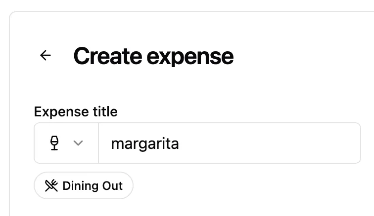

Welcome to `vNEXT`! Auto-categorization gets a speed boost with [TypeSafe's](https://github.com/typesafe-ai) System One Jev model, and uncertain guesses now surface as one-tap suggestion chips.

## Highlights

- Super-fast auto-categorization with System One Jev
- Suggestion chips when the category is uncertain

### Super-fast auto-categorization with System One Jev

The local dictionary and group-history matching existed largely to work around slow LLM categorization: even after exploring vector stores and embeddings over larger datasets, the LLM still took ~2 seconds on a good day. Jev reaches good accuracy in ~250 ms, so it can now do the heavy lifting.

The cascade stays the same — dictionary, then group history, then exactly one AI engine (`AI_CATEGORY_ENGINE=llm|system-one`, default `llm`) — but the shipped default for `CATEGORY_LOCAL_MIN_SCORE` moves from `0.7` to `0.8`, giving the AI engine more room. Spliit Cloud runs with the higher gate so Jev sees more titles; self-hosters staying on the LLM can set it back toward `0.7` with `CATEGORY_LOCAL_*` overrides. Prefer to self-host the decision model? Point `AI_SYSTEM_ONE_BASE_URL` at a `/v1/systemone`-compatible server (e.g. Kev or Laya) and keep `AI_CATEGORY_ENGINE=system-one`.

When no stage is confident enough, the expense form now shows the runners-up as suggestion chips — one scrolling row with category icons, no wrapping — so a near miss is one tap away instead of a manual category hunt. Decisive verdicts stay quiet. And if you'd rather skip AI altogether, category extraction can be switched off in account settings.

**"margarita" lands on drinks, with dining-out one tap away**

## What's Changed

### 🚀 Features

- Category suggestions can now use a System One decision-model engine instead of the LLM: set `AI_CATEGORY_ENGINE=system-one` with `AI_SYSTEM_ONE_API_KEY` (TypeSafe's Jev via `jev-latest` by default; a self-hosted `/v1/systemone`-compatible model such as Kev or Laya via `AI_SYSTEM_ONE_BASE_URL`, with `AI_SYSTEM_ONE_MODEL` and `AI_SYSTEM_ONE_TIMEOUT_SECONDS` overrides) (`TBD` by @TBD)
- Uncertain categories now surface as one-tap suggestion chips: when nothing auto-applies, the expense form shows the closest runners-up in a single horizontally scrolling row with category icons; a near-tie runner-up is offered next to an applied suggestion too, covering dictionary guesses, LLM runner-ups, and Jev's probability split, while decisive verdicts stay quiet (`TBD` by @TBD)
- Local suggestion stages are tunable per deployment and stay in sync between app and server: `CATEGORY_DICTIONARY_ENABLED` / `CATEGORY_HISTORY_ENABLED` toggles plus `CATEGORY_LOCAL_MIN_SCORE` (now `0.8`, was `0.7`) and `CATEGORY_LOCAL_SETTLEMENT_MIN_SCORE` gates, with one shared `AI_CATEGORY_MIN_CONFIDENCE` floor (default `0.5`) for both AI engines; the LLM now reports confidence in its verdict, and per-user AI preferences in account settings can switch category extraction off (`TBD` by @TBD)

### 🐛 Bug fixes

- Smarter local category suggestions: short words like "in"/"to" no longer trigger false brand matches ("Beers in Prague" suggested insurance), the generic "premium" alias no longer maps alcohol to insurance, and a near-exact dictionary hit now overrules a twice-repeated past mislabel (`TBD` by @TBD)

**Full Changelog**: TBD
