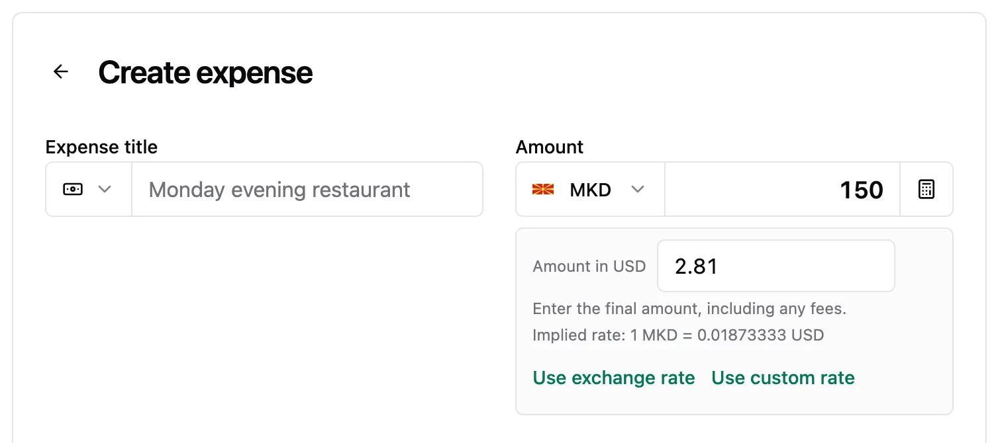
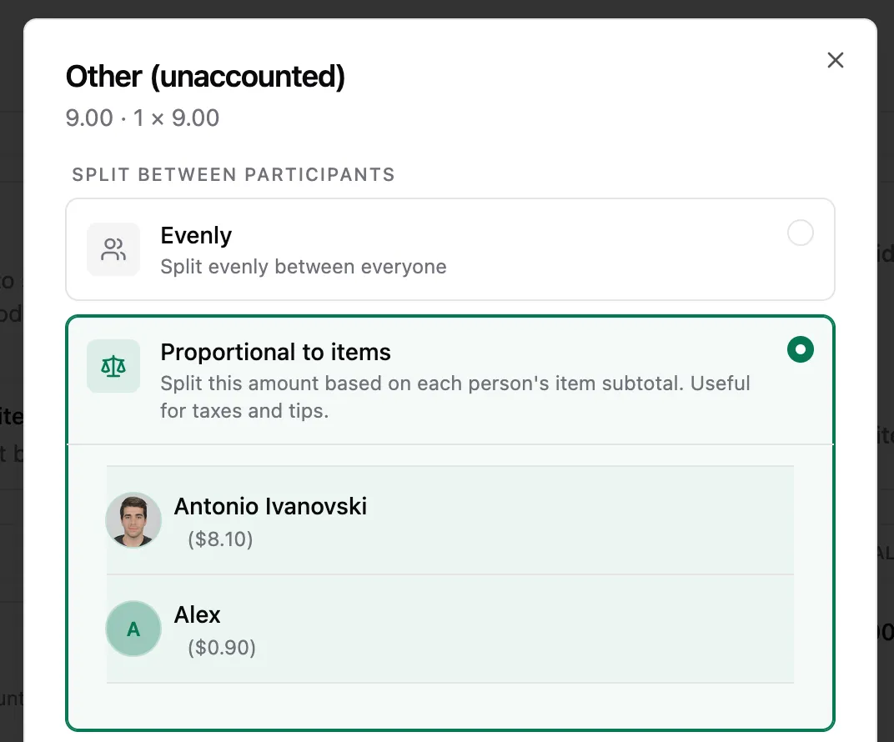
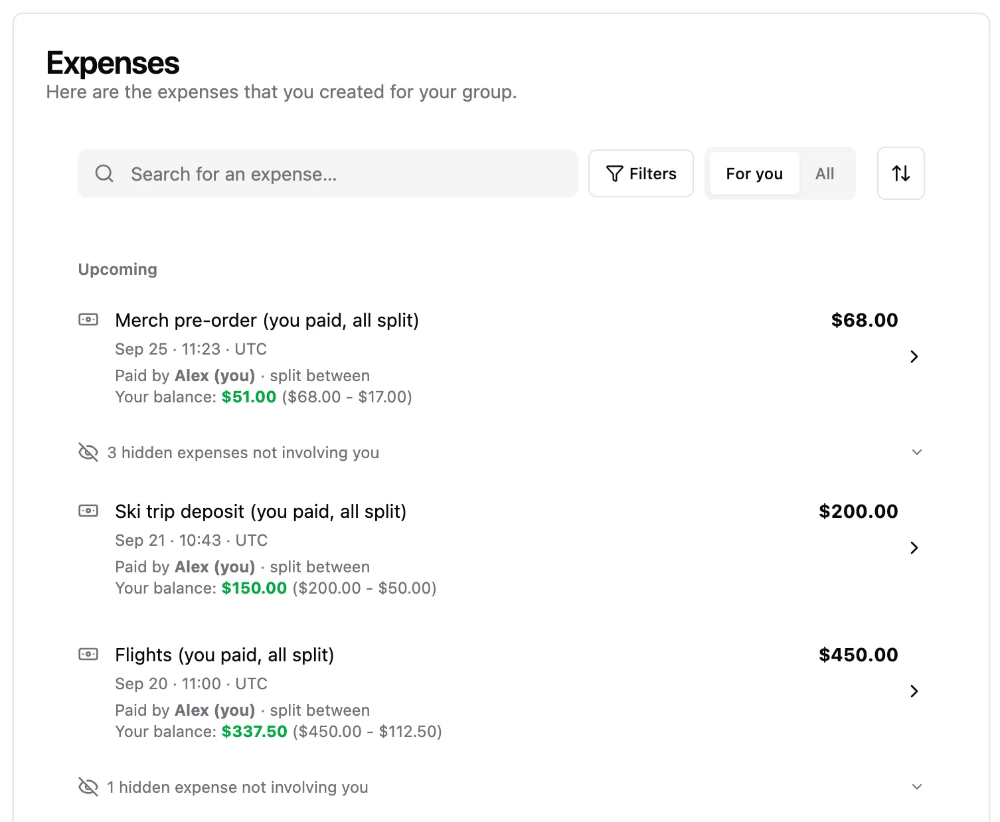
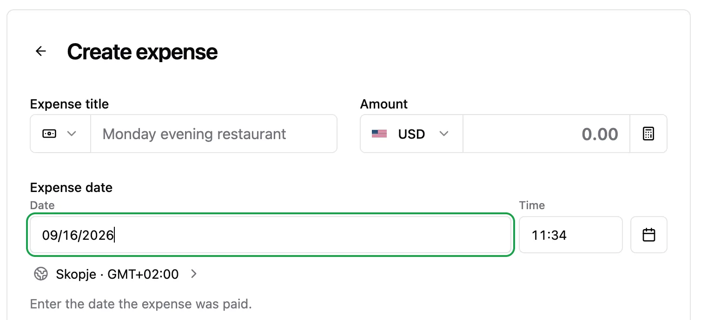
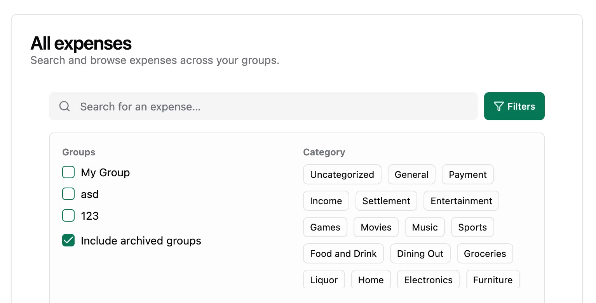

Welcome to `vNEXT`! A growing collection of improvements: exact group-currency amounts for foreign-currency expenses, proportional tax/tip splitting for itemized expenses, a calmer expense timeline that spotlights your own expenses, plus explicit crawler permissions and a sitemap for the public site. More to come.

## Highlights

- Enter the exact amount charged in the group currency
- Split taxes and tips proportional to items
- See only the expenses that involve you
- Type the expense date and time directly
- Search archived groups from All expenses

### Enter the exact amount charged in the group currency

Paying abroad rarely matches the daily exchange rate once card fees land. When an expense uses a foreign currency, choose **Edit amount in {group currency}** to type the final charged total directly — prefilled from the current estimate and rounded to the group currency, with the implied rate shown underneath. The expense preview keeps the group-currency total front and center with a compact `Original: USD 100.00 · 1 USD = 0.9347 EUR` line beneath it.

### Split taxes and tips proportional to items

Itemized expenses used to split the leftover **Other (unaccounted)** amount evenly — so a 10% tax on an $85.91 + $5.00 bill charged both people $4.54. Now the remainder editor offers **Proportional to items**, which shares taxes, tips, or both according to each person's item subtotal ($8.59 and $0.50 in that example). Equal splitting stays the default, and existing expenses keep their current behavior.

### See only the expenses that involve you

Busy group timelines now hide expenses you neither paid nor owe a share of, collapsing each hidden run behind an inline "N hidden expenses not involving you" row right where it sits in chronological order — expand any run in place without losing your position. Pages are built around the expenses that involve you, so every screenful stays dense even when most expenses don't. Showing everything is one tap away with the **For you / All** switch in the toolbar — flipping views keeps the current list on screen while the other view loads, then swaps it in all at once with no flashing skeleton. Your choice is kept in the URL so filtered views stay shareable.

### Type the expense date and time directly

No more clicking through the calendar for every backdated expense — just type the date in your locale's format and the time as `HH:mm`, with the calendar and time picker still one click away for browsing. Invalid entries stay visible with an error instead of silently keeping the old value.

### Search archived groups from All expenses

Archived groups were invisible to global search unless you picked each one by hand. Tick **Include archived groups** in the All expenses filters to search across them, with archived and hidden groups now labeled distinctly in the group list.

## What's Changed

### 🚀 Features

- Publish explicit crawler permissions and a sitemap for the public site (`TBD` by @TBD)
- Enter the exact amount charged in the group currency for foreign-currency expenses, including fees, with the implied rate shown inline — closes [#111](https://github.com/antonio-ivanovski/spliit-cloud/issues/111) (`TBD` by @TBD)
- Split the itemized "Other (unaccounted)" remainder proportional to each participant's item subtotal for fair taxes and tips, with equal splitting kept as the default — closes [#114](https://github.com/antonio-ivanovski/spliit-cloud/issues/114) (`TBD` by @TBD)
- Hide expenses that don't involve you from the group timeline by default, with inline expandable rows that preserve chronological order and a "For you / All" switch (`TBD` by @TBD)
- Type the expense or income date and time directly in the form, with the calendar and time picker still one click away (`TBD` by @TBD)
- Search expenses in archived groups from All expenses with the new "Include archived groups" filter (`TBD` by @TBD)

**Full Changelog**: TBD
