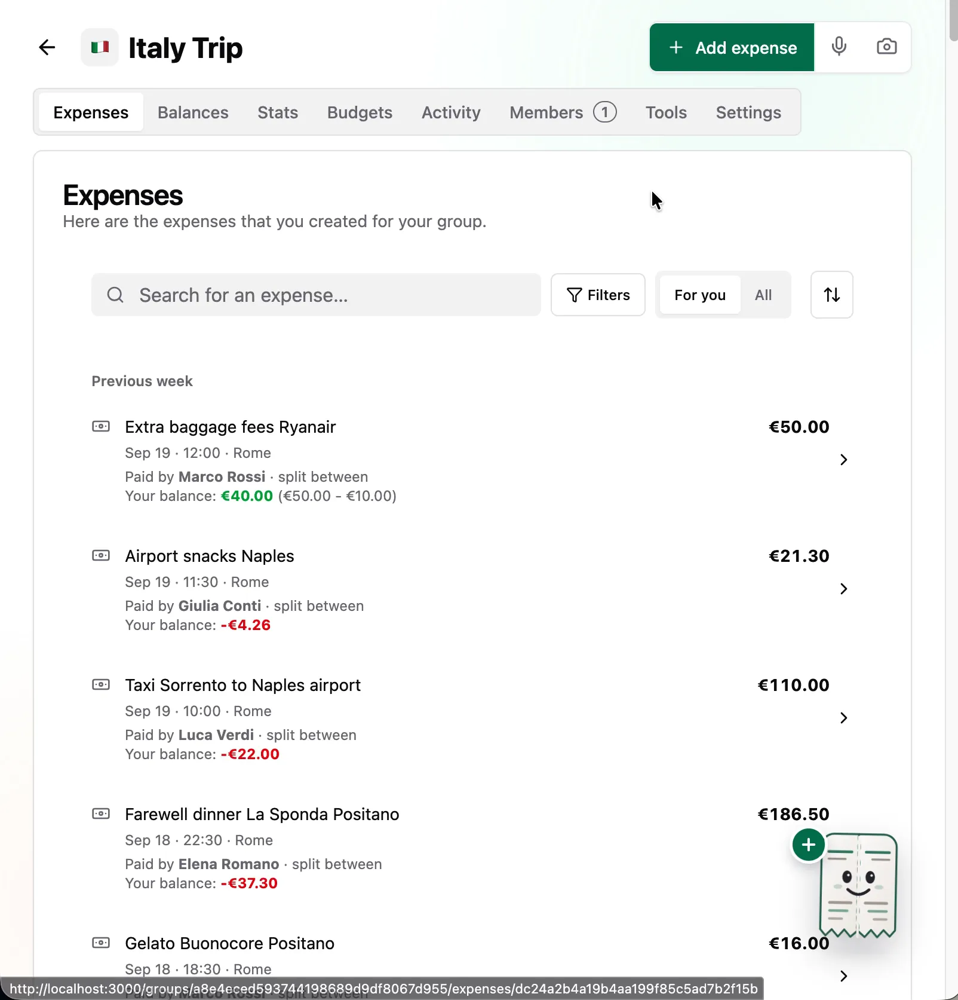
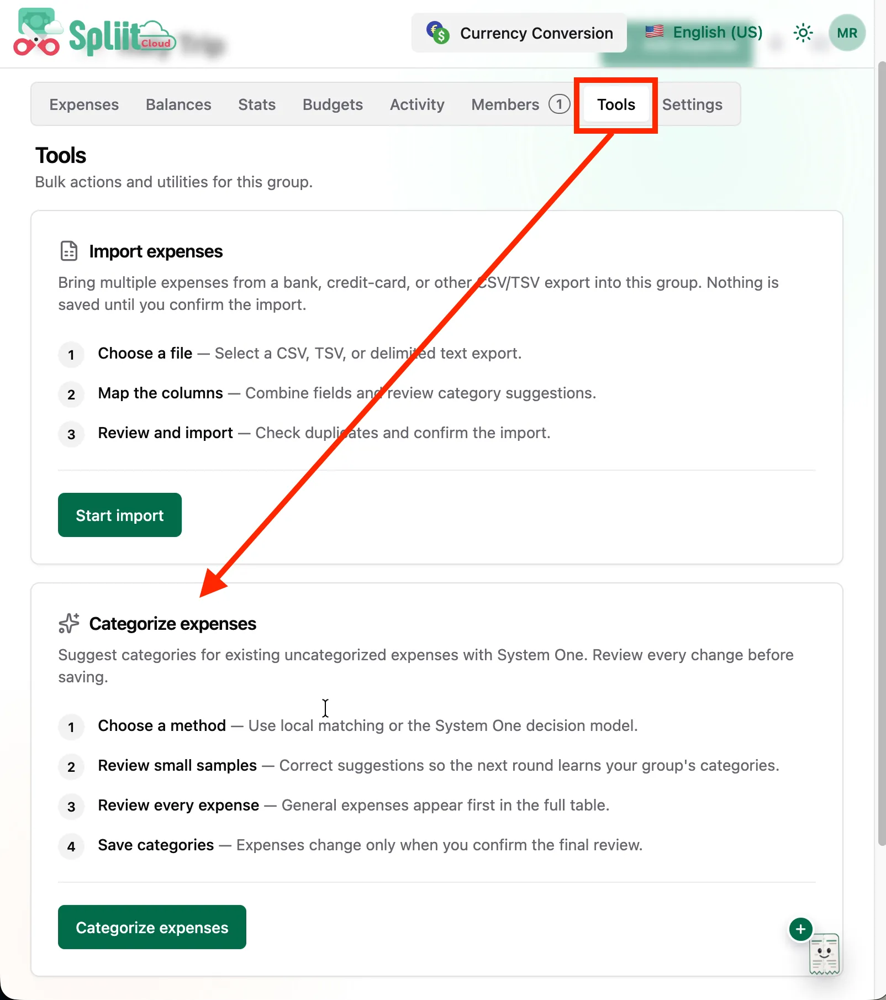
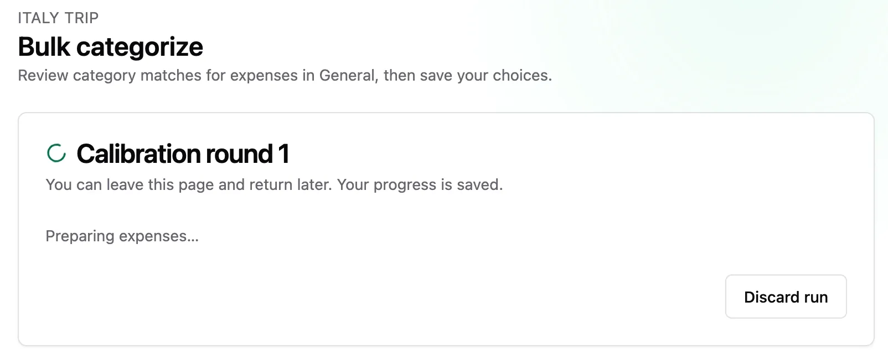
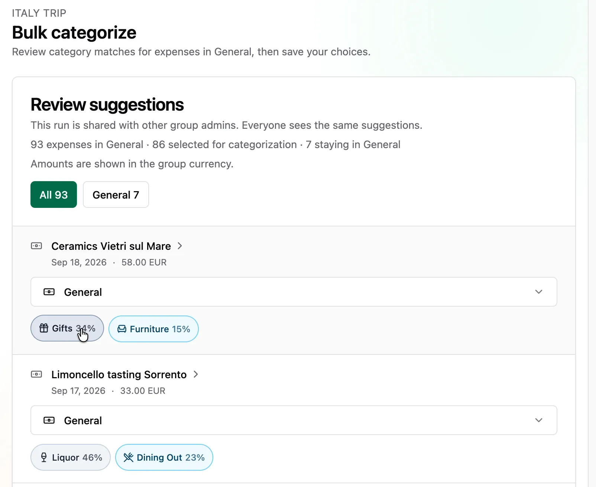
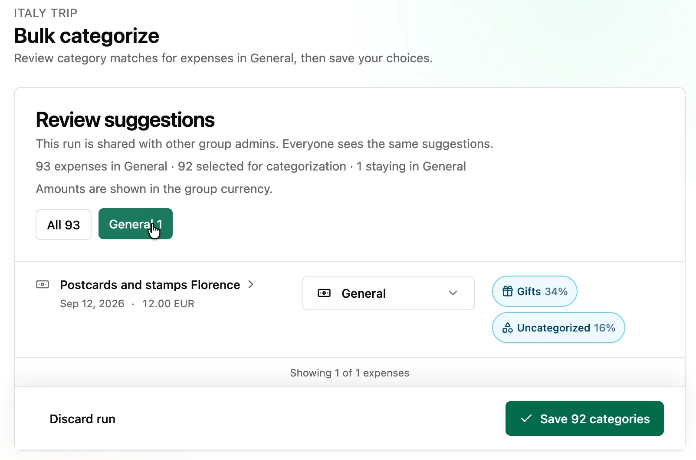
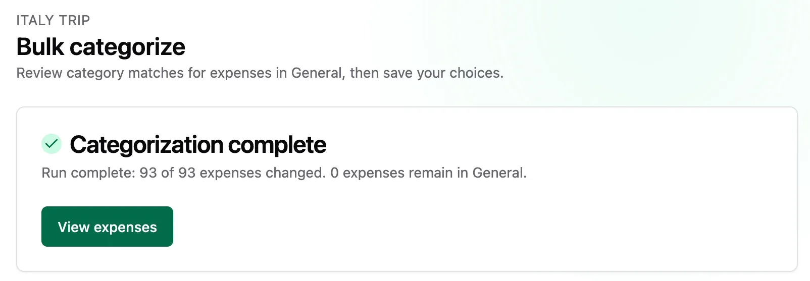
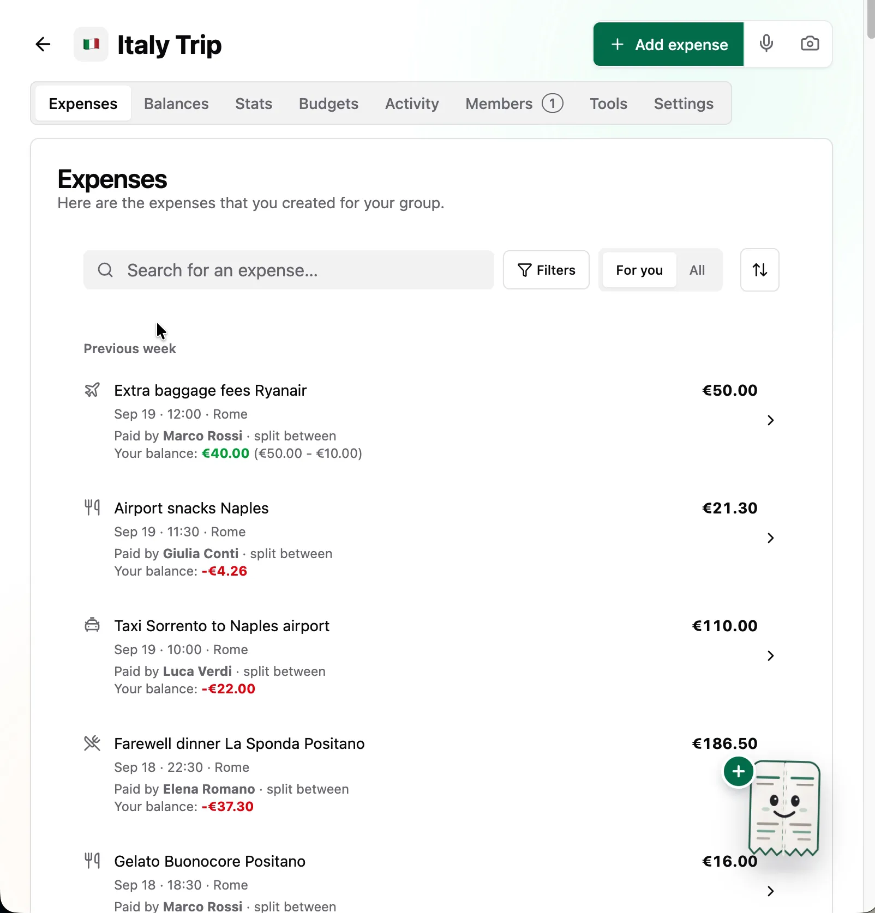

Welcome to `vNEXT`! Bulk-categorize existing group expenses from Tools — pick Dictionary & history or the System One decision model, review suggestions, rerun the leftovers, and save everything at once.

## Highlights

- Bulk-categorize existing expenses from Tools

### Bulk-categorize existing expenses from Tools

Pick Dictionary & history or the System One decision model and categorize a whole group at once. Confirm a few calibration samples, review suggestions in a fast virtualized table with match strength and confidence, rerun remaining General or uncertain expenses using your corrections, and save the selected categories atomically. Progress tracks processed expenses across calibration, refinement, and reruns; runs are shared between group admins with safe retries and conflict recovery; large groups up to 10,000 expenses are supported.

Here's the full flow, step by step:

**1. Start with a messy list.** Imported expenses land in General with generic icons — hard to tell dinner apart from transport.

**2. Open Tools and start categorizing.** Head to the Tools tab and hit "Categorize expenses".

**3. Choose how to categorize.** Use fast Dictionary & history matching, which runs on the server, or the System One decision model for trickier expenses.

**4. Calibration begins.** The first round prepares your expenses — you can leave and come back anytime; progress is saved.

**5. Confirm a few samples.** Review a small calibration batch (e.g. "Trattoria Da Enzo dinner" → Dining Out 100%) and hit "Confirm round" to teach the run your preferences.

**6. Watch the first run.** Suggestions roll in with live progress — reviewed, provisionally categorized, and remaining General counts stay visible.

**7. Review and accept suggestions.** In the review table, click a chip to accept a suggestion — each chip shows its confidence at a glance.

**8. Filter the leftovers.** Use the General filter to isolate expenses still without a category and handle them one by one.

**9. Rerun with your corrections.** Rerun the leftovers — the second pass learns from what you just accepted and updates suggestions with fresh progress.

**10. Save everything at once.** When the run completes, save all categories atomically — conflicts are surfaced so nothing is silently overwritten.

**11. Enjoy a tidy list.** Every expense now carries its category icon — baggage fees fly, dinners dine, taxis drive.

## What's Changed

### 🚀 Features

- Added a Tools flow to bulk-categorize existing group expenses with Dictionary & history or the System One decision model: calibration samples, virtualized review with match strength and confidence, reruns that learn from corrections, accurate progress across rounds, shared runs with safe retries and conflict recovery, and an atomic save (`TBD` by @handle)

**Full Changelog**: TBD
