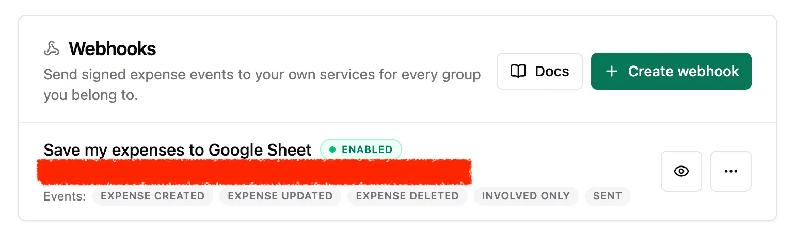
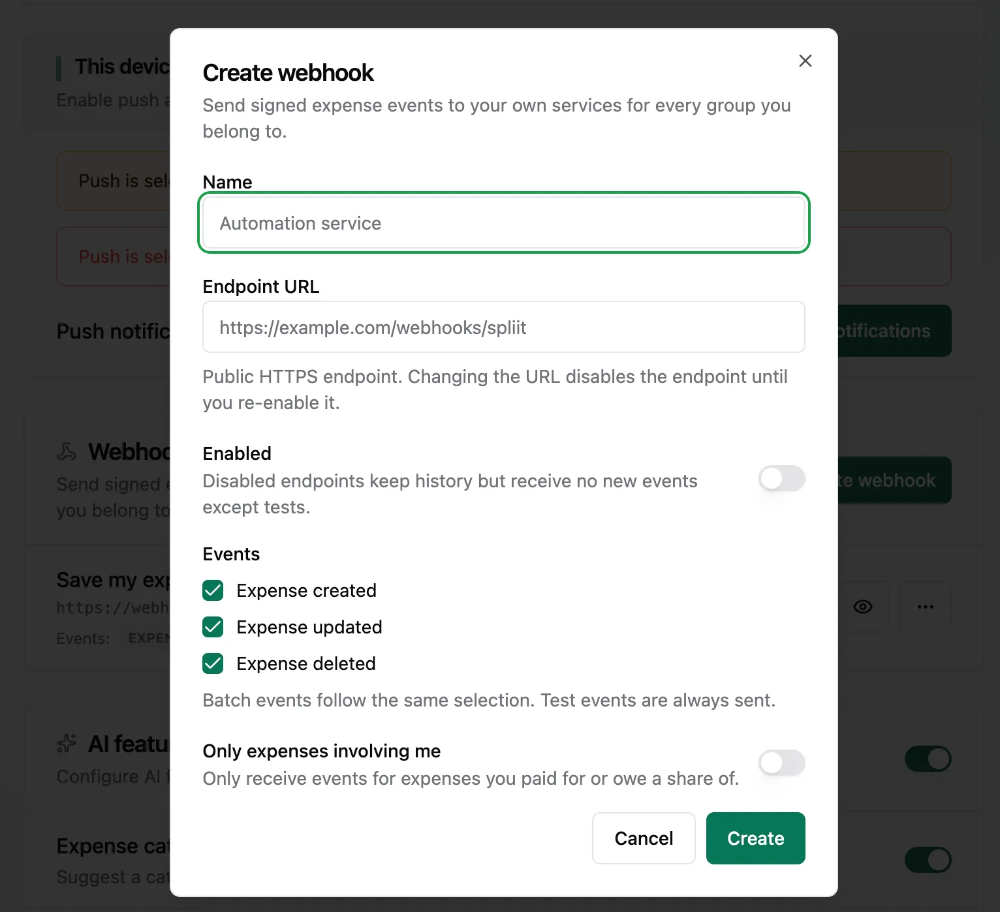
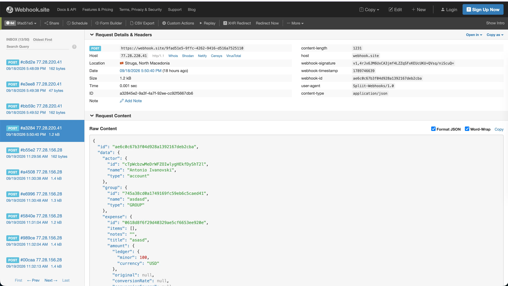
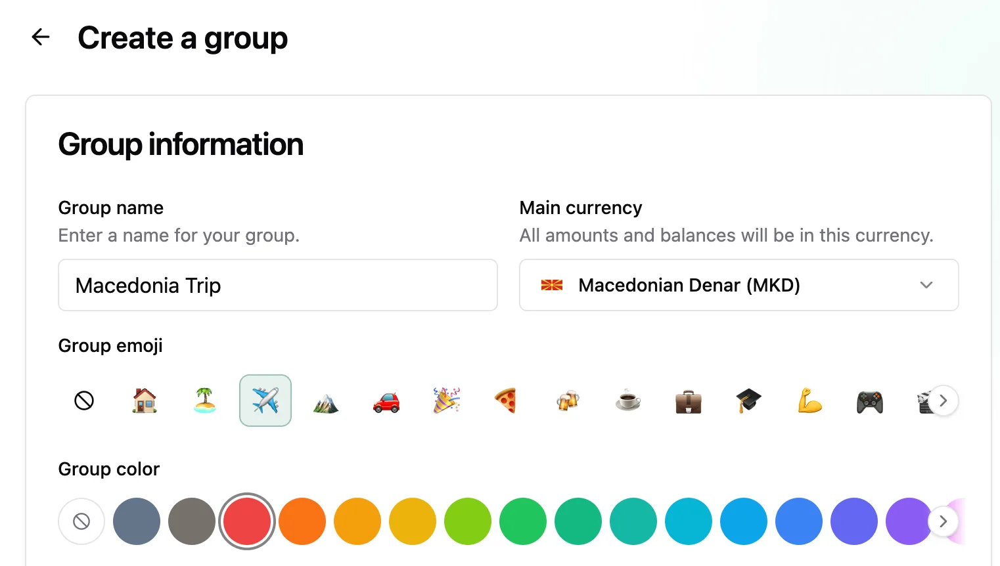

Welcome to `vNEXT`! The flagship of this release is outbound webhooks — Spliit can now push expense changes to your own integrations in real time — alongside group emoji and colors and a round of smaller polish fixes.

## Highlights

- Outbound webhooks: real-time expense events for your own integrations
- Group emoji and colors: give every group its own look

### Outbound webhooks: real-time expense events for your own integrations

Spliit no longer ends at the screen: point it at any HTTPS endpoint you own and every expense creation, update, and deletion arrives as a signed event, seconds after it happens. Build the automations you've been missing — a bot that announces new expenses to your group chat, a dashboard that tracks spending live, a sync job that mirrors expenses into your accounting tool.

Each event is signed so you can verify it really came from your instance, deliveries retry automatically with backoff, and everything is manageable from account settings: per-endpoint event selection, delivery history with manual redelivery, test sends, and secret rotation. Full setup, event reference, and signature verification are documented in [docs/webhooks.md](https://github.com/antonio-ivanovski/spliit-cloud/blob/vNEXT/docs/webhooks.md). Events even carry a personal `viewer` block — what you paid, what you owe, and your net on each expense — and endpoints can opt into hearing only about expenses you're personally involved in, so noisy group feeds stay quiet.

This one was requested by the community — thanks to @obsilover for proposing it in #98.

**Manage endpoints in account settings**

**Create an endpoint with per-event selection**

**Test the feature on [webhook.site](https://webhook.site)**

### Group emoji and colors: give every group its own look

Every group can now carry an emoji and a color. Pick both inline when creating or editing a group — a scrollable emoji row, an 18-color palette, and custom emoji or hex color when the presets don't fit. The emoji shows up on a full-height colored rail on the home screen and in the import destination picker, the color tints the card, and on the group page the same color warms the ambient background in both light and dark mode.

Typing or pasting a single emoji into the group name moves it into the emoji field on the spot, with an Undo right there — existing groups get a one-time offer to lift an emoji out of their name, and Spliit Cloud imports prefill the picker from the export while your edits still win.

**Pick an emoji and a color right in the group form**

**Emoji rails and color-tinted cards on the home screen**

## What's Changed

### 🚀 Features

- Added outbound webhooks: subscribe any HTTPS endpoint to expense created/updated/deleted events, with signed payloads, a personal `viewer` block, involved-only filtering, automatic retries, delivery history with manual redelivery, test sends, secret rotation, and a Create/Edit/View setup dialog with delete confirmation (`TBD` by @TBD)
- Added SSO-only mode: set `ENABLE_EMAIL_AUTH=false` to hide sign-in with email (password + magic link) and make SMTP optional; email sign-in endpoints are rejected with `EMAIL_AUTH_DISABLED`, invite-only signup still passes by pending email match, and email invitations stay in-app with a delivery warning when no email can be sent — fixes #121 (`TBD` by @TBD)
- Prepared the web app manifest for future store packaging: app shortcuts (create group, all expenses, account settings), install screenshots, and Digital Asset Links groundwork (`TBD` by @TBD)
- Added group emoji and color: pick both inline in the group form and the import wizard's new-group step (custom emoji and hex included; Spliit Cloud exports prefill the picker and your edits override), shown as emoji rails, color-tinted cards, and a tinted ambient background, with live title-emoji extraction including Undo and a one-time prompt to move an emoji out of an existing group's name (`TBD` by @TBD)
- Tinted the page ambient background with the group color: inside a group that has a color set, the emerald/coral backdrop orbs take on the group hue at their usual subtle strength, in both light and dark mode; groups without a color keep the default backdrop (`TBD` by @TBD)
- Published machine-readable `agent_auth` metadata in OAuth authorization-server discovery pointing at dynamic client registration and the user-consent flow, with `/auth.md` as the step-by-step guide, so agent-readiness scanners and auth.md clients can find the registration surface (`TBD` by @TBD)
- Added Markdown content negotiation for the public static pages (`/`, `/terms`, `/privacy`, `/imprint`, `/sponsor`): requests that explicitly accept `text/markdown` receive a clean Markdown representation with a token-count header on both the Cloudflare Pages and Docker deployments, while browsers keep receiving HTML (`TBD` by @TBD)

### 🐛 Bug fixes

- Rejected authentication return paths that become external redirects after URL normalization (`TBD` by @TBD)
- Preserved group share-link invites through password, magic-link, SSO, and anonymous authentication; invited guests can now create accounts on invite-only instances and return to the group to accept — fixes #123 (`TBD` by @TBD)
- Fixed trailing slashes in URL envs (`APP_URL=https://host/` flowed into `WEB_ORIGINS`/`BETTER_AUTH_URL`) producing `//groups/…` invite links and breaking CORS/trusted-origins sign-in: all URL envs are now stripped to their canonical slash-less form with a startup warning — fixes #120 (`TBD` by @TBD)
- Fixed the install dialog's split-button layout and shortened its copy (`TBD` by @TBD)
- Never show the install promotion inside the already-installed app, whatever display mode it launched in (`TBD` by @TBD)
- Fixed toasts rendering inline below the footer; they now float at the top (centered on mobile, top-right on desktop) (`TBD` by @TBD)
- Fixed the expenses timeline hiding the "not involving you" toggle when hidden expenses sit at the top of the list; leading hidden expenses are now included on the first page, and groups with no involving expenses show collapsed hidden runs instead of an empty list (`TBD` by @TBD)
- Fixed item prices in expense details and expense cards showing the group currency for converted expenses; stored item amounts are now shown in the expense's own currency — fixes #125 (`TBD` by @TBD)
- Made "no SMTP" a first-class state: without `SMTP_HOST` no EMAIL-channel notification is planned, sent, or retried (stored email preferences are kept but stay inert), notification settings show a delivery warning with the Email option disabled, and the push onboarding dialog stops offering email as a fallback and instead prompts affected users to enable push (`TBD` by @TBD)
- Fixed mobile pickers staying behind the iOS software keyboard: currency, timezone, locale, and category drawers now lift above the keyboard and stay within the visible viewport, with native Android keyboard resizing as a progressive enhancement — fixes #124 (`TBD` by @TBD)

**Full Changelog**: TBD
