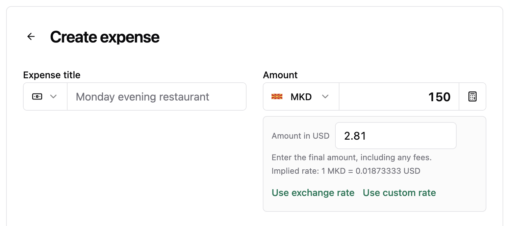

Welcome to `vNEXT`! A growing collection of improvements — so far: exact group-currency amounts for foreign-currency expenses, plus explicit crawler permissions and a sitemap for the public site. More to come.

## Highlights

- Enter the exact amount charged in the group currency

### Enter the exact amount charged in the group currency

Paying abroad rarely matches the daily exchange rate once card fees land. When an expense uses a foreign currency, choose **Edit amount in {group currency}** to type the final charged total directly — prefilled from the current estimate and rounded to the group currency, with the implied rate shown underneath. The expense preview keeps the group-currency total front and center with a compact `Original: USD 100.00 · 1 USD = 0.9347 EUR` line beneath it.

## What's Changed

### 🚀 Features

- Publish explicit crawler permissions and a sitemap for the public site (`TBD` by @TBD)
- Enter the exact amount charged in the group currency for foreign-currency expenses, including fees, with the implied rate shown inline — closes [#111](https://github.com/antonio-ivanovski/spliit-cloud/issues/111) (`TBD` by @TBD)

**Full Changelog**: TBD
