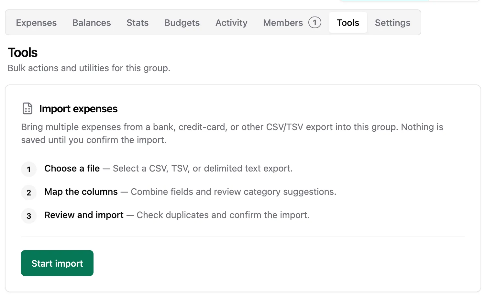
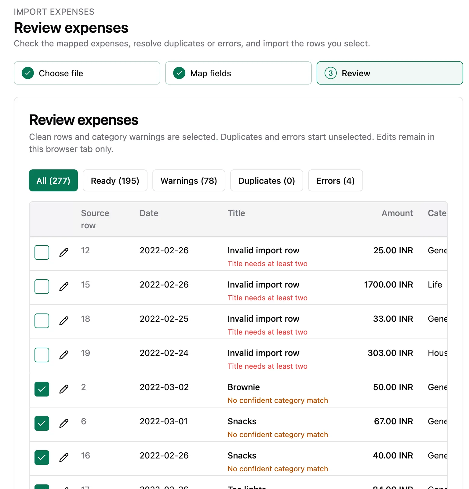

Welcome to `vNEXT` — the first versioned release! From here on, Spliit Cloud ships version by version instead of rolling `main` builds. The `2.x` line also marks the break from the inherited upstream `1.x` tags.

## Highlights

- Import expenses from CSV files
- Versioned Docker images with a stable `:latest`
- Hand-written changelog on every release
- The public instance now follows releases, not every commit

### Import expenses from CSV files

Bring your bank spending into Spliit without retyping it. Upload a bank statement CSV and a guided wizard walks you through column mapping with a live preview, category mapping, batch defaults, and a final review that flags duplicates and conflicts before anything is written. Large statements parse in a background worker so the UI stays responsive, and the import commits atomically with idempotency protection. (Moving over from another expense-tracking app? Use the group import feature instead.)

### Versioned Docker images with a stable `:latest`

Every release publishes immutable `:vX.Y.Z` images for all five services (api, migrate, worker, mcp, web). `:latest` now always equals the newest stable release — never a work-in-progress `main` build. Pin `SPLIIT_TAG=vNEXT` for controlled upgrades, or follow stable with `SPLIIT_TAG=latest`.

### Hand-written changelog on every release

Each release ships notes written for humans: highlights with screenshots, a full list of changes, and — when needed — a breaking-changes section with exact migration steps. The notes live in the repo under `releases/` so they are reviewable like any other change.

### The public instance now follows releases

`spliit.cloud` (Dokploy + Cloudflare Pages) deploys when a version is cut, immediately and as one unit — instead of redeploying on every `main` commit.

## What's Changed

### 🚨 Breaking Changes

- `:latest` images no longer track `main` — they point at the newest stable release. If you relied on `:latest` for daily builds, pin a version instead.
- Per-commit `sha-*` releases and the moving `rolling` release are retired. Only `:vX.Y.Z` and `:latest` tags are published from here on.

### 🚀 Features

- Import group expenses from a bank statement CSV via a mapping wizard with duplicate detection and atomic, idempotent commits — suggested in [#91](https://github.com/antonio-ivanovski/spliit-cloud/issues/91) (`6ebd96c` by @antonio-ivanovski)
- Delegated OAuth API access for agents, scripts, and external apps with standard discovery from just the API URL, read-only-by-default per-resource scopes with same-client step-up, per-scope consent, connected-app controls in account settings with immediate cutoff on disconnect, and a manual copy-back page (`/oauth/manual-callback`) for CLIs that cannot receive a redirect — thanks to @dorian-pltr for the original work in [#101](https://github.com/antonio-ivanovski/spliit-cloud/pull/101) and the patience through review (`TBD` by @dorian-pltr)
- Tag-gated release workflow: push `vX.Y.Z`, get images, GitHub Release, and prod deploy in one go (`TBD` by @TBD)
- Per-version notes files (`releases/vX.Y.Z.md`) with colocated screenshots (`releases/assets/vX.Y.Z/`) (`TBD` by @TBD)
- Self-hosting docs rewritten around version pinning (`SPLIIT_TAG=vX.Y.Z`) (`TBD` by @TBD)
- Test runner upgraded to Vitest 5 stable (dev tooling only) (`TBD` by @TBD)
- English (UK) locale ships only its differing strings (`behaviour`, `Normalise`, `authorisation`) and inherits the rest from US English — sparse overlays with fallback chains, also applied to pt-BR (`aa64456` by @antonio-ivanovski)
- Automatic PWA updates: new versions apply on their own whenever it is safe — clean tabs refresh without asking, unfinished edits or in-progress work in any open window silently hold the update, and everything resumes automatically once the work finishes. Routine waits and restarts show no pill or dialog; only an update that fails to apply shows one, with Retry and Dismiss. The Restart/Later dialogs and the restart-all override are gone. One accepted trade-off: keystrokes landing in the split second between the final safety check and the refresh are not preserved — everything already on screen is (`TBD` by @TBD)

**Full Changelog**: TBD
