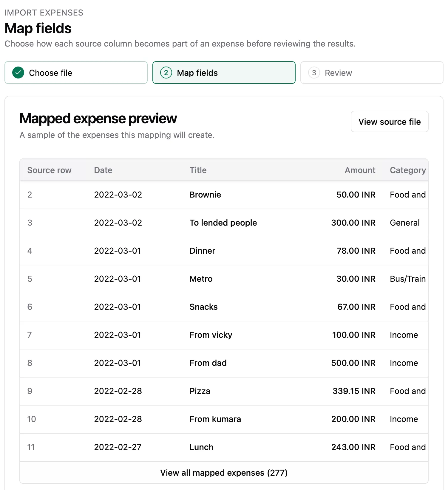
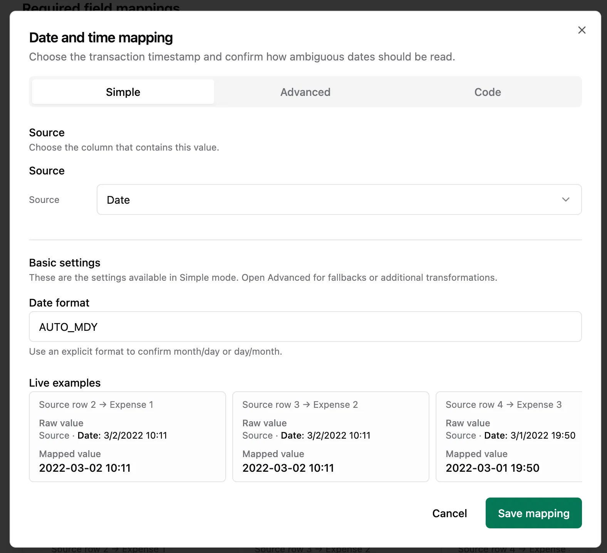
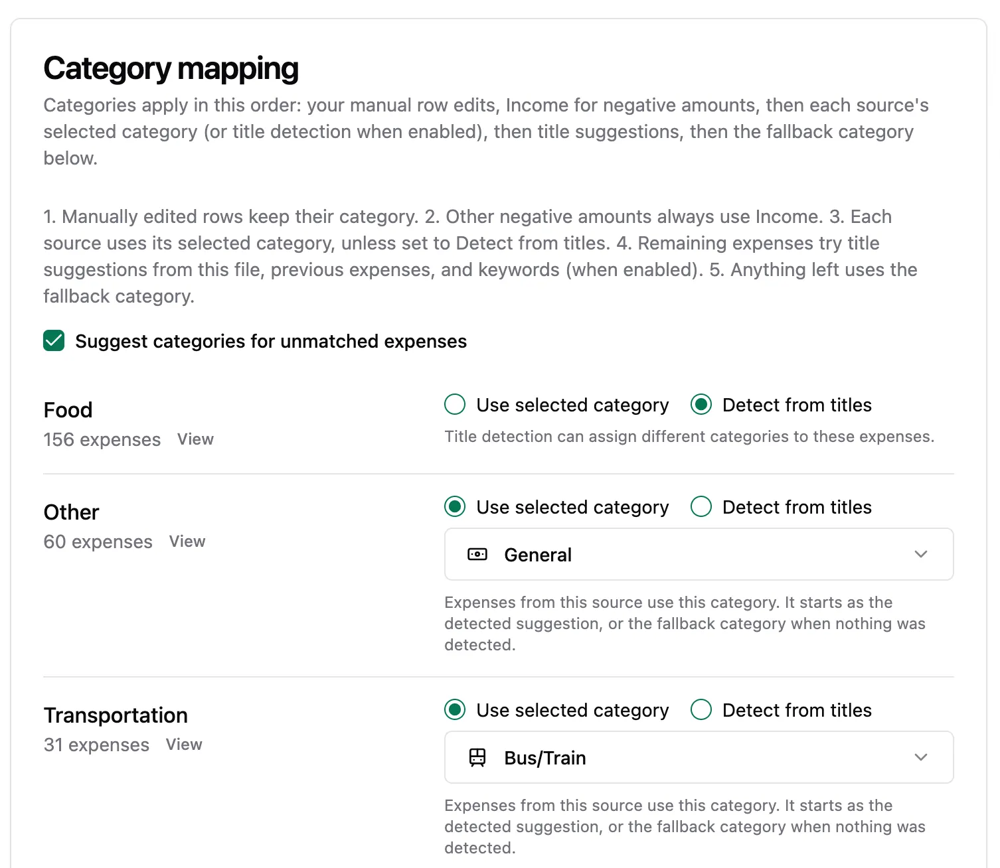
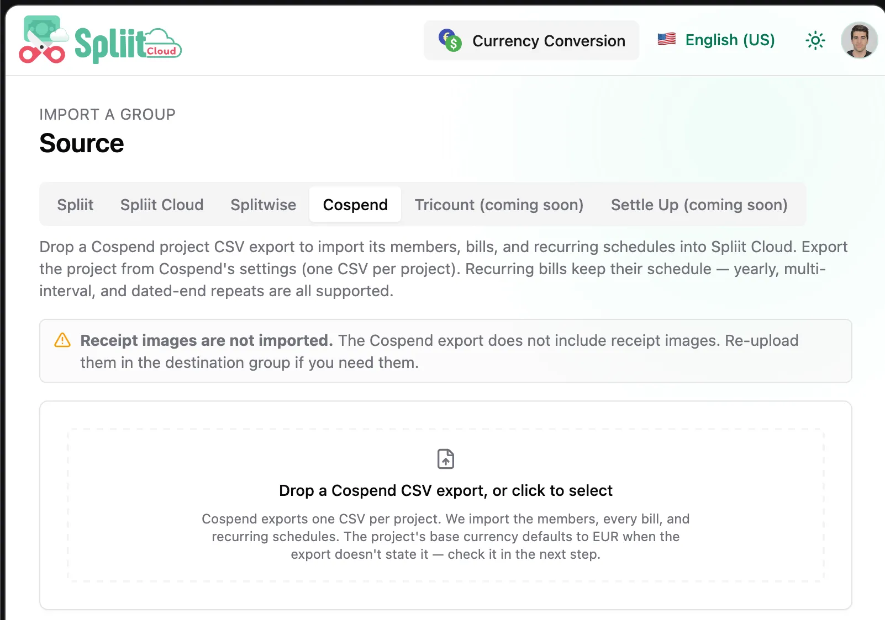
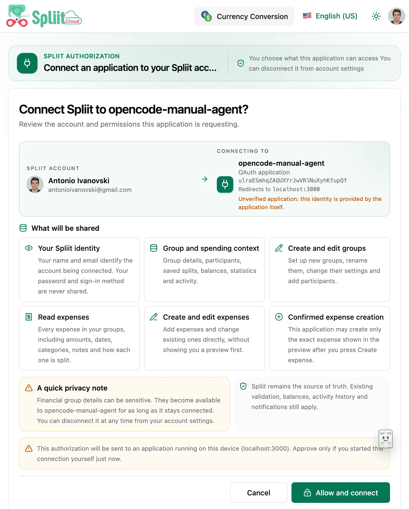
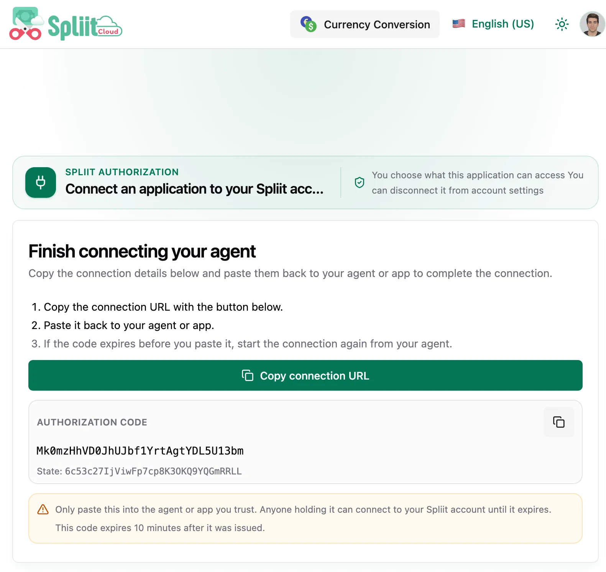
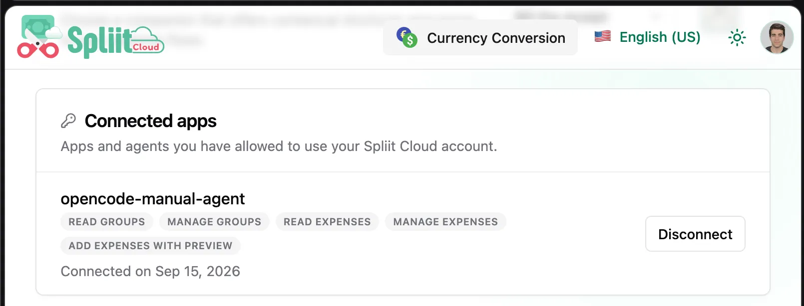
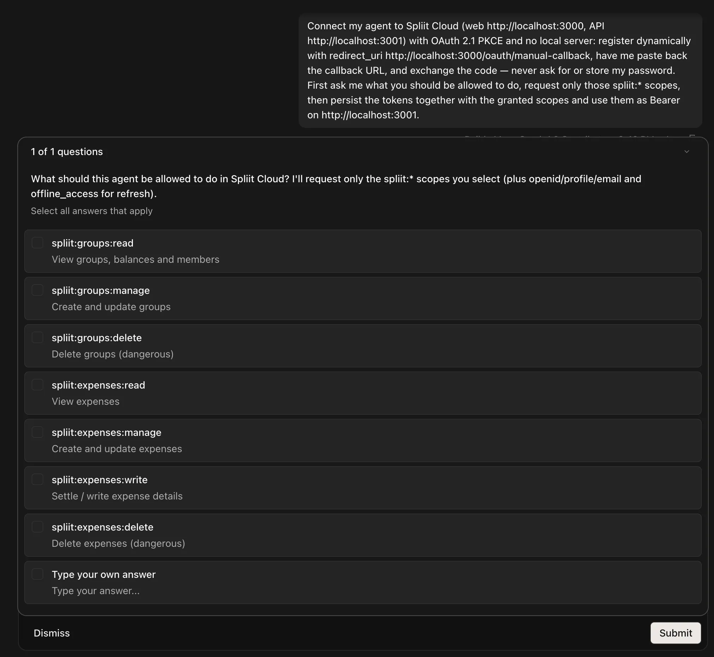

Welcome to `v2.0.0` — the first versioned release! From here on, Spliit Cloud ships version by version instead of rolling `main` builds. The `2.x` line also marks the break from the inherited upstream `1.x` tags.

## Highlights

- Import expenses from bank statement CSVs
- Import a Cospend project as a Spliit group
- Delegated OAuth API access for agents, scripts, and external apps
- Silent automatic PWA updates
- Versioned Docker images with a stable `:latest`
- Hand-written changelog on every release
- The public instance now follows releases, not every commit

### Import expenses from bank statement CSVs

Bring your bank spending into Spliit without retyping it. Upload a bank statement CSV from the group's Tools tab and a guided wizard walks you through column mapping with a live preview, category mapping, batch defaults, and a final review that flags duplicates and conflicts before anything is written. Large statements parse in a background worker so the UI stays responsive, and the import commits atomically with idempotency protection. (Moving over from another expense-tracking app? Use the group import feature instead.)









### Import a Cospend project as a Spliit group

Moving over from Cospend? The dedicated group importer (`/groups/import`, Cospend tab) brings the whole project across: members, bills with weight-proportional splits, categories, and recurring schedules (including yearly, multi-interval, and dated-end repeats) into a new or existing group, with participant mapping, currency conversion, and a confirmation step before anything is written.



### Delegated OAuth API access for agents, scripts, and external apps

Agents and scripts no longer need a browser session. The API runs its own OAuth 2.1 authorization server unconditionally, with standard discovery from just the API URL, read-only-by-default per-resource scopes (`spliit:groups:read`, `spliit:expenses:read`, and friends, with destructive verbs behind opt-in delete scopes and same-client step-up), per-scope consent, connected-app controls in account settings with immediate cutoff on disconnect, and a manual copy-back page (`/oauth/manual-callback`) for CLIs that cannot receive a redirect. Discovery works from just the web origin too: OAuth/OIDC metadata is proxied from `spliit.cloud`, with a machine-readable API catalog (`/.well-known/api-catalog`), an agent card (`/.well-known/agent-card.json`), a human- and machine-readable auth guide (`/auth.md`), and `Link` headers pointing at the OpenAPI spec and docs.







**Connect your agent — paste this:**

```text
Connect my agent to Spliit Cloud (web https://spliit.cloud, API https://api.spliit.cloud) with OAuth 2.1 PKCE and no local server: register dynamically with redirect_uri https://spliit.cloud/oauth/manual-callback, have me paste back the callback URL, and exchange the code — never ask for or store my password. First ask me what you should be allowed to do, request only those spliit:* scopes, then persist the tokens together with the granted scopes and use them as Bearer on https://api.spliit.cloud.
```



Scope details live in [docs/api-access.md](https://github.com/antonio-ivanovski/spliit-cloud/blob/v2.0.0/docs/api-access.md#scopes); the machine-readable flow is at [spliit.cloud/auth.md](https://spliit.cloud/auth.md).

### Silent automatic PWA updates

New versions apply on their own whenever it is safe — clean tabs refresh without asking, unfinished edits or in-progress work in any open window silently hold the update, and everything resumes automatically once the work finishes. Routine waits and restarts show no pill or dialog; only an update that fails to apply shows one, with Retry and Dismiss. The Restart/Later dialogs and the restart-all override are gone. One accepted trade-off: keystrokes landing in the split second between the final safety check and the refresh are not preserved — everything already on screen is.

### Versioned Docker images with a stable `:latest`

Every release publishes immutable `:vX.Y.Z` images for all five services (api, migrate, worker, mcp, web). `:latest` now always equals the newest stable release — never a work-in-progress `main` build. Pin `SPLIIT_TAG=v2.0.0` for controlled upgrades, or follow stable with `SPLIIT_TAG=latest`.

### Hand-written changelog on every release

Each release ships notes written for humans: highlights with screenshots, a full list of changes, and — when needed — a breaking-changes section with exact migration steps. The notes live in the repo under `releases/` so they are reviewable like any other change.

### The public instance now follows releases

`spliit.cloud` (Dokploy + Cloudflare Pages) deploys when a version is cut, immediately and as one unit — instead of redeploying on every `main` commit.

## What's Changed

### 🚨 Breaking Changes

- `:latest` images no longer track `main` — they point at the newest stable release. If you relied on `:latest` for daily builds, pin a version instead.
- Per-commit `sha-*` releases and the moving `rolling` release are retired. Only `:vX.Y.Z` and `:latest` tags are published from here on.

### 🚀 Features

- Import group expenses from a bank statement CSV via a mapping wizard with duplicate detection and atomic, idempotent commits — suggested in [#91](https://github.com/antonio-ivanovski/spliit-cloud/issues/91) (`f45e3801` by @antonio-ivanovski)
- Import a Cospend project CSV export (members, bills with weight-proportional splits, categories, and recurring schedules including yearly, multi-interval, and dated-end repeats) into a Spliit group via a new tab in the import wizard — closes [#110](https://github.com/antonio-ivanovski/spliit-cloud/issues/110) (`184cd634` by @eikaramba)
- Delegated OAuth API access for agents, scripts, and external apps with standard discovery from just the API URL, read-only-by-default per-resource scopes with same-client step-up, per-scope consent, connected-app controls in account settings with immediate cutoff on disconnect, and a manual copy-back page (`/oauth/manual-callback`) for CLIs that cannot receive a redirect — thanks to @dorian-pltr for the original work in [#101](https://github.com/antonio-ivanovski/spliit-cloud/pull/101) and the patience through review (`15ea5425` by @dorian-pltr)
- Agent discovery from just the web origin: OAuth/OIDC discovery proxied from `spliit.cloud`, machine-readable API catalog (`/.well-known/api-catalog`), agent card (`/.well-known/agent-card.json`), auth guide (`/auth.md`), and `Link` headers pointing at the OpenAPI spec and docs (`b59a9e53`, `2e97b7da` by @antonio-ivanovski)
- Tag-gated release workflow: push `vX.Y.Z`, get images, GitHub Release, and prod deploy in one go (`35932841` by @antonio-ivanovski)
- Per-version notes files (`releases/vX.Y.Z.md`) with colocated screenshots (`releases/assets/vX.Y.Z/`) (`35932841` by @antonio-ivanovski)
- Self-hosting docs rewritten around version pinning (`SPLIIT_TAG=vX.Y.Z`) (`35932841` by @antonio-ivanovski)
- Test runner upgraded to Vitest 5 stable (dev tooling only) (`b7ca001c` by @antonio-ivanovski)
- English (UK) locale ships only its differing strings (`behaviour`, `Normalise`, `authorisation`) and inherits the rest from US English — sparse overlays with fallback chains, also applied to pt-BR (`000cf28b` by @antonio-ivanovski)
- Automatic PWA updates: new versions apply on their own whenever it is safe — clean tabs refresh without asking, unfinished edits or in-progress work in any open window silently hold the update, and everything resumes automatically once the work finishes. Routine waits and restarts show no pill or dialog; only an update that fails to apply shows one, with Retry and Dismiss. The Restart/Later dialogs and the restart-all override are gone. One accepted trade-off: keystrokes landing in the split second between the final safety check and the refresh are not preserved — everything already on screen is (`534dc34c` by @antonio-ivanovski)

### 🐛 Bug fixes

- Fix currency input to handle locale-specific decimal separators: a trailing decimal typed with the non-locale separator is preserved (e.g. Brazil-region iOS keyboards emitting `,` while the app locale expects `.`), without mistaking grouping for a decimal — fixes [#115](https://github.com/antonio-ivanovski/spliit-cloud/issues/115) (`99f5b5e9` by @antonio-ivanovski)

**Full Changelog**: [1.19.1...v2.0.0](https://github.com/antonio-ivanovski/spliit-cloud/compare/1.19.1...v2.0.0)
