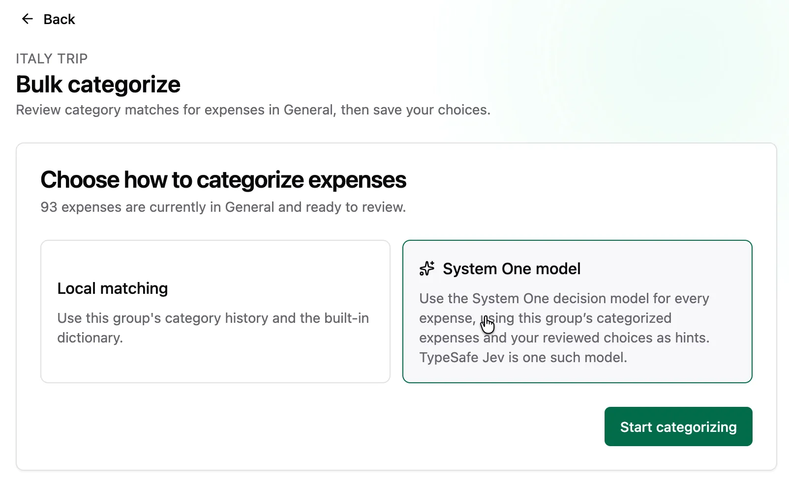
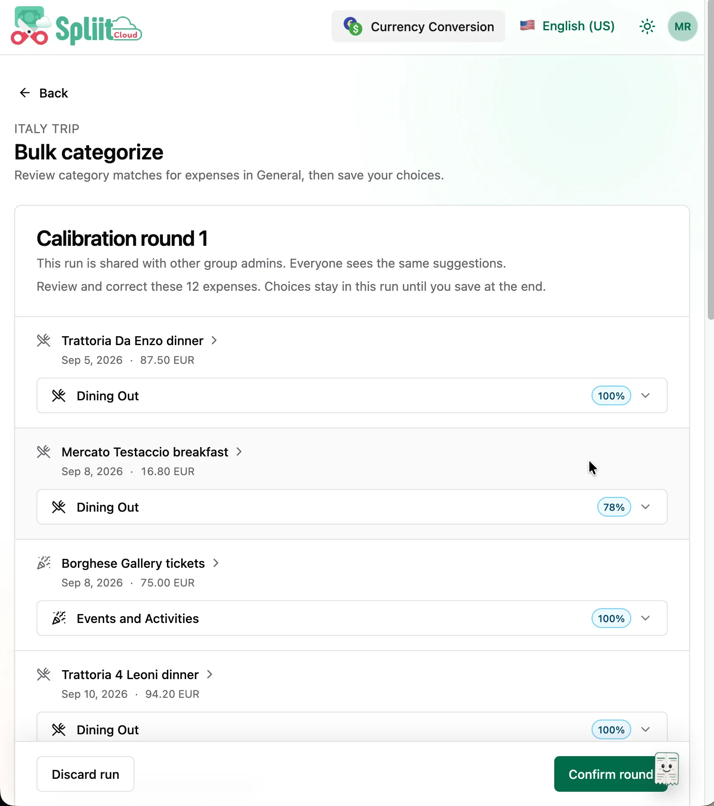
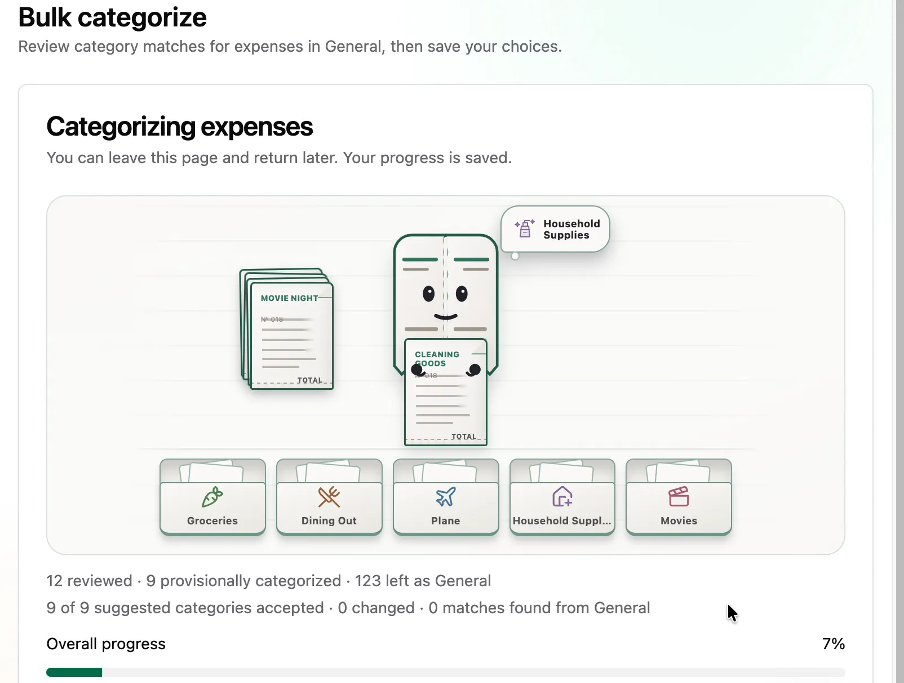
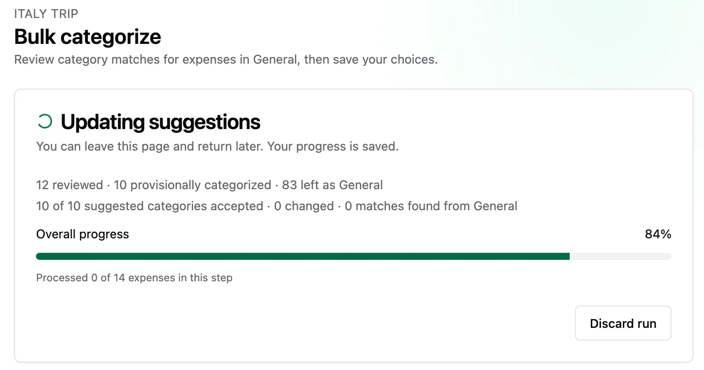

Welcome to `v2.4.0`! The long-awaited bulk categorization is here — no other expense-splitting app lets you categorize a whole group at once. It has amazing synergy with group import and CSV import: bring in a messy pile of expenses, then tidy them all up in one flow from Tools — review suggestions, rerun the leftovers, and save everything at once.

## Highlights

- Bulk-categorize existing expenses from Tools

### Bulk-categorize existing expenses from Tools

Powered by the TypeSafe Jev decision model as the primary categorizer — with the local Dictionary & history matcher as an alternative for self-hosters. Confirm a few calibration samples, review suggestions in a fast virtualized table with match strength and confidence, rerun remaining General or uncertain expenses using your corrections, and save the selected categories atomically. Some napkin math: LLM-based bulk categorization of 100 expenses runs around 3 minutes, while Jev does it in about 3 seconds — with far more stable requests and far easier background-job scheduling. Progress tracks processed expenses across calibration, refinement, and reruns; runs are shared between group admins with safe retries and conflict recovery; large groups up to 10,000 expenses are supported.

Here's the full flow, step by step:

**1. Start with a messy list.** Imported expenses land in General with generic icons — hard to tell dinner apart from transport.

**2. Open Tools and start categorizing.** Head to the Tools tab and hit "Categorize expenses".

**3. Choose how to categorize.** Jev leads as the primary categorizer for speed and stability, or use the local Dictionary & history matcher — a great alternative for self-hosters.

**4. Calibration begins.** The first round prepares your expenses — you can leave and come back anytime; progress is saved.

**5. Confirm a few samples.** Review a small calibration batch (e.g. "Trattoria Da Enzo dinner" → Dining Out 100%) and hit "Confirm round" to teach the run your preferences.

**6. Watch the first run.** Suggestions roll in with live progress — reviewed, provisionally categorized, and remaining General counts stay visible.

**7. Review and accept suggestions.** In the review table, click a chip to accept a suggestion — each chip shows its confidence at a glance.

**8. Filter the leftovers.** Use the General filter to isolate expenses still without a category and handle them one by one.

**9. Rerun with your corrections.** Rerun the leftovers — the second pass learns from what you just accepted and updates suggestions with fresh progress.

**10. Save everything at once.** When the run completes, save all categories atomically — conflicts are surfaced so nothing is silently overwritten.

**11. Enjoy a tidy list.** Every expense now carries its category icon — baggage fees fly, dinners dine, taxis drive.

## What's Changed

### 🚀 Features

- Added a Tools flow to bulk-categorize existing group expenses with the TypeSafe Jev decision model as primary categorizer and Dictionary & history as a local alternative for self-hosters: calibration samples, virtualized review with match strength and confidence, reruns that learn from corrections, accurate progress across rounds, shared runs with safe retries and conflict recovery, and an atomic save ([`0c69ebb8`](https://github.com/antonio-ivanovski/spliit-cloud/commit/0c69ebb8d71a96b84302fc6150a4e91408da6d4c) by @antonio-ivanovski)

### 🐛 Bug fixes

- Made the installed PWA feel more native without disabling pinch-zoom: double-tap zoom is suppressed via `touch-action`, and PWA launches get overscroll/tap-highlight tuning. Thanks @KihtrakRaknas for reporting (#129) ([`b00110b8`](https://github.com/antonio-ivanovski/spliit-cloud/commit/b00110b84dc3dffae6f452af57aa6aa28abcfcfa) by @antonio-ivanovski)
- Dismissed stale validation errors as soon as a field is edited across auth, account, budget, invitation, and comment forms, and kept itemized expense and share rows top-aligned so error text no longer centers sibling inputs. Thanks @KihtrakRaknas for reporting (#131, #132) ([`16ba8138`](https://github.com/antonio-ivanovski/spliit-cloud/commit/16ba8138149fbea10f1acd8dfd50f67e46eb5fe5) by @antonio-ivanovski)

**Full Changelog**: [v2.3.3...v2.4.0](https://github.com/antonio-ivanovski/spliit-cloud/compare/v2.3.3...v2.4.0)
