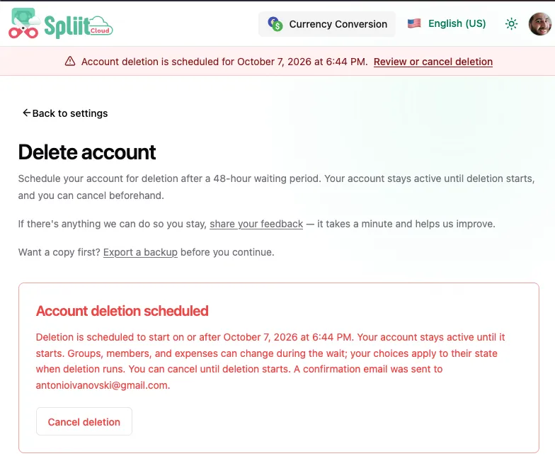

Welcome to `v2.5.0`! A personal Activity tab, account deletion with a 48-hour safety net, quieter notifications, and ChatGPT plugin readiness.

## Highlights

- Activity tab is now personal
- Delete your account with a 48-hour safety net

### Activity tab is now personal

The Activity tab mirrors the expenses timeline: a `For you / All` toggle, inline `N hidden activities not involving you` rows, and a per-row `Your share:` line under each expense.

### Delete your account with a 48-hour safety net

Account settings has a new Danger zone with a dedicated Delete account review page. Choose whether shared history keeps your name or shows “Deleted member”, and whether remaining balances stay as they are or are marked settled when deletion runs. You see per-group consequences before typing DELETE to schedule, and you can cancel any time during the 48-hour waiting period while your account stays active.

## What's Changed

### 🚀 Features

- Added a Support page (`/support`, with a Markdown companion and sitemap entry) as the public support contact for the app and the ChatGPT plugin listing ([`762d6000`](https://github.com/antonio-ivanovski/spliit-cloud/commit/762d6000c7151798b224f787265599e382c52297) by @antonio-ivanovski)
- Expense deletes now offer a plain confirmation mode: switch Account settings → Expense delete confirmation to Confirmation dialog to delete expenses with a simple confirm instead of typing the title, while deleting a group or removing a member always requires typing. Typed expense delete dialogs link straight to the setting ([`e7c8cb89`](https://github.com/antonio-ivanovski/spliit-cloud/commit/e7c8cb8922c926fac911048e281eb7010f07d700) by @antonio-ivanovski)
- Activity tab is now personal: expense rows show your share (`Your share:`) or `You are not involved`, and a `For you / All` toggle with inline `N hidden activities not involving you` rows mirrors the expenses timeline. Past activity rows were backfilled with participant data where recoverable. Thanks @KihtrakRaknas for opening [#150](https://github.com/antonio-ivanovski/spliit-cloud/issues/150) ([`f6046d7e`](https://github.com/antonio-ivanovski/spliit-cloud/commit/f6046d7e6aa63b834da3cd4586fa68edabed31f4) by @antonio-ivanovski)
- Hardened the privacy notice with data categories, purposes, recipients, retention, connected-application disclosure, and user controls ([`762d6000`](https://github.com/antonio-ivanovski/spliit-cloud/commit/762d6000c7151798b224f787265599e382c52297) by @antonio-ivanovski)
- Delete your account from a dedicated review page, with a 48-hour cancellation period while your account stays active ([`29f56e45`](https://github.com/antonio-ivanovski/spliit-cloud/commit/29f56e453be0c6a23bd52668f0484023148aa167) by @antonio-ivanovski)
- Curated Updates now introduce selected releases once per account and keep past announcements in an in-app archive. Spliit Cloud news email can be switched off in notification settings or from any campaign email. ([`02efff0f`](https://github.com/antonio-ivanovski/spliit-cloud/commit/02efff0f165dc32fe0180b22eeb9aa60c6d93168) by @antonio-ivanovski)
- Push setup is quieter: new accounts see the “Choose how to stay up to date” choice once, returning push users get a one-time native permission prompt on a new device instead of the full modal, and email-only accounts are never nagged outside Settings. ([`56540aed`](https://github.com/antonio-ivanovski/spliit-cloud/commit/56540aedbb1942c6535ac05767ee2702ac290e7e) by @antonio-ivanovski)
- Prepared the ChatGPT plugin directory submission: password-first reviewer login without guest accounts, configurable domain-verification token, and a versioned submission package with review cases ([`762d6000`](https://github.com/antonio-ivanovski/spliit-cloud/commit/762d6000c7151798b224f787265599e382c52297) by @antonio-ivanovski)

### 🐛 Bug fixes

- Fixed magic-link signup on invite-only instances when the group invitation is nested inside a sign-in redirect. Thanks @natekspencer for opening [#151](https://github.com/antonio-ivanovski/spliit-cloud/issues/151) ([`de4e7ac3`](https://github.com/antonio-ivanovski/spliit-cloud/commit/de4e7ac3e8d6272532eca0c861cd35d80a3f6c8b) by @antonio-ivanovski)

**Full Changelog**: [v2.4.3...v2.5.0](https://github.com/antonio-ivanovski/spliit-cloud/compare/v2.4.3...v2.5.0)
